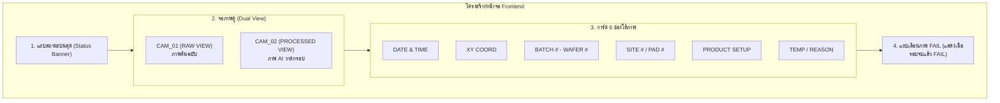

# 📘 คู่มือและข้อกำหนดการพัฒนา Frontend i.MX8 (HMI Client Guide)

เอกสารนี้สรุปข้อกำหนดและโค้ดตัวอย่างสำหรับนำไปพัฒนาหน้าจอ **Frontend i.MX8 (PMI Display)** เพื่อเชื่อมต่อกับ **`backend_imx8` (Port 8001)** ผ่าน REST API

---

## 1. ⚙️ การตั้งค่าการเชื่อมต่อ (Base URL)

กำหนด Base URL ชี้ไปยัง IP ของเครื่อง Backend i.MX8:
```javascript
const API_BASE = "http://localhost:8001"; // หรือ http://<IP_เครื่อง_iMX8>:8001
```

---

## 2. 🔌 REST API Endpoints Specification

### 📡 1. ดึงภาพและข้อมูลผลตรวจล่าสุด (Live Inspection Polling)
* **Method & URL**: `GET /api/latest-inspection`
* **จังหวะเรียก**: Polling ทุกๆ `500ms` หรือ `1000ms` ระหว่างการตรวจสอบ
* **Response JSON**:
```json
{
  "decision": "PASS",
  "reason": "-",
  "rawImageUrl": "/api/images/raw/TR7A9073/TR7A9073_X37Y2_S10_P15.jpg",
  "annotatedImageUrl": "/api/images/annotated/TR7A9073/TR7A9073_X37Y2_S10_P15.jpg",
  "dateTime": "2026-05-05 11:46:49",
  "xyCoord": "X37Y2",
  "waferNo": "TR7A9073-W25C5",
  "batch": "TR7A9073",
  "site": "S10",
  "pad": "P15",
  "productSetup": "29D5B0FBAA-PC611",
  "temp": "300"
}
```

> **วิธีโหลดภาพ**: นำ `API_BASE` มาต่อหน้า URL ภาพ เช่น:
> ``

---

### 📡 2. ดึงสถานะสรุปรอบ Wafer (Batch Summary)
* **Method & URL**: `GET /api/batch-summary`
* **จังหวะเรียก**: Polling พร้อมกับ `latest-inspection` เพื่อเช็กว่าจบรอบหรือยัง

#### กรณีที่ 1: กำลังตรวจอยู่ (In-Progress / `isBatchComplete: false`)
```json
{
  "isBatchComplete": false,
  "batchDecision": "PASS",
  "totalImages": 15,
  "failCount": 0,
  "failedRecords": [],
  "batch": "TR7A9073",
  "waferNo": "TR7A9073-W25C5"
}
```

#### กรณีที่ 2: จบรอบการตรวจแล้ว (Batch Complete / `isBatchComplete: true`)
```json
{
  "isBatchComplete": true,
  "batchDecision": "FAIL",
  "totalImages": 35,
  "failCount": 2,
  "batch": "TR7A9073",
  "waferNo": "TR7A9073-W25C5",
  "mask": "02000008",
  "txtFile": "FAIL_02000008_PROBER01_20260505115000.txt",
  "failedRecords": [
    {
      "decision": "FAIL",
      "reason": "Probe Mark Close to Edge",
      "rawImageUrl": "/api/images/raw/TR7A9073/TR7A9073_X37Y2_S10_P15.jpg",
      "annotatedImageUrl": "/api/images/annotated/TR7A9073/TR7A9073_X37Y2_S10_P15.jpg",
      "dateTime": "2026-05-05 11:46:49",
      "xyCoord": "X37Y2",
      "waferNo": "TR7A9073-W25C5",
      "batch": "TR7A9073",
      "site": "S10",
      "pad": "P15",
      "productSetup": "29D5B0FBAA-PC611",
      "temp": "300"
    }
  ]
}
```

---

### 📡 3. สั่งรีเซ็ตรอบด้วยตนเอง (Manual Reset - ตัวเลือกเสริม)
* **Method & URL**: `POST /api/batch/reset`
* *(หมายเหตุ: Backend มีระบบ Auto-Reset เมื่อภาพแรกของแผ่นใหม่เข้ามาอยู่แล้ว)*

---

## 3. 🖥️ ข้อกำหนดการออกแบบหน้าจอ (UI Components & Logic)



### 1. Top Status Banner (แถบสถานะ)
* **ระหว่างตรวจ (`!isBatchComplete`)**: แสดงสีส้ม/ฟ้า ➔ **`INSPECTING`** (หรือสถานะของภาพล่าสุด)
* **จบรอบแล้วผ่าน (`isBatchComplete && batchDecision === "PASS"`)**: แสดงสีเขียว ➔ **`PASS`**
* **จบรอบแล้วไม่ผ่าน (`isBatchComplete && batchDecision === "FAIL"`)**: แสดงสีแดง ➔ **`FAIL`**

### 2. Dual View (จอภาพ 2 ฝั่ง)
* **จอซ้าย (CAM_01)**: แสดงภาพจาก `rawImageUrl`
* **จอขวา (CAM_02)**: แสดงภาพจาก `annotatedImageUrl`

### 3. Metadata 6 ช่องใต้ภาพ
1. **DATE & TIME**: `data.dateTime`
2. **XY COORDINATE**: `data.xyCoord`
3. **BATCH # - WAFER #**: `${data.batch} - ${data.waferNo}`
4. **SITE # / PAD #**: `${data.site} / ${data.pad}`
5. **PRODUCT SETUP**: `data.productSetup`
6. **TEMP**: `${data.temp}°C` *(พร้อมแสดง Badge สีแดงระบุ `data.reason` หากรูปนั้นเป็น FAIL)*

### 4. Fail Carousel / Navigation Mode (เมื่อผลรวมเป็น FAIL)
เมื่อ `isBatchComplete === true` และ `batchDecision === "FAIL"`:
* แสดงปุ่ม **`◀ Prev`** และ **`Next ▶`** พร้อมข้อความตัวเลขตำแหน่ง เช่น **`1 / 3`**
* ดักจับ Event คีย์บอร์ด: กดปุ่มลูกศร `←` (Previous) และ `→` (Next)
* เมื่อกดเลื่อน: ให้นำข้อมูลจาก `batchData.failedRecords[currentIndex]` ไปอัปเดตทั้ง **Dual View** และ **การ์ด 6 ช่อง** ให้เปลี่ยนตามทันที

---

## 4. 💻 ตัวอย่างโค้ดพร้อมใช้ (React Component Example)

```jsx
import React, { useState, useEffect } from "react";

const API_BASE = "http://localhost:8001";

export default function PmiInspectionView() {
  const [latest, setLatest] = useState(null);
  const [batch, setBatch] = useState(null);
  const [failIndex, setFailIndex] = useState(0);

  // 1. Polling ดึงข้อมูลจาก Backend ทุก 500ms
  useEffect(() => {
    const interval = setInterval(async () => {
      try {
        const [resLatest, resBatch] = await Promise.all([
          fetch(`${API_BASE}/api/latest-inspection`).then((r) => r.json()),
          fetch(`${API_BASE}/api/batch-summary`).then((r) => r.json())
        ]);
        setLatest(resLatest);
        setBatch(resBatch);
      } catch (err) {
        console.error("Failed to connect to backend:", err);
      }
    }, 500);

    return () => clearInterval(interval);
  }, []);

  // 2. ดักปุ่มลูกศร คีย์บอร์ด ← / → สำหรับเลื่อนดู FAIL
  useEffect(() => {
    const handleKeyDown = (e) => {
      if (!batch?.isBatchComplete || batch?.batchDecision !== "FAIL") return;
      const totalFails = batch.failedRecords?.length || 0;
      if (totalFails <= 1) return;

      if (e.key === "ArrowLeft") {
        setFailIndex((prev) => (prev > 0 ? prev - 1 : totalFails - 1));
      } else if (e.key === "ArrowRight") {
        setFailIndex((prev) => (prev < totalFails - 1 ? prev + 1 : 0));
      }
    };

    window.addEventListener("keydown", handleKeyDown);
    return () => window.removeEventListener("keydown", handleKeyDown);
  }, [batch]);

  // เลือกว่าจะโชว์ภาพอะไร (ภาพสด หรือ ภาพในโหมด Fail Carousel)
  const isFailMode = batch?.isBatchComplete && batch?.batchDecision === "FAIL";
  const displayItem = isFailMode && batch.failedRecords?.[failIndex] 
    ? batch.failedRecords[failIndex] 
    : latest;

  if (!displayItem) return <div>Waiting for inspection data...</div>;

  return (
    <div className="pmi-container" style={{ padding: 20, background: "#1a1a1a", color: "#fff" }}>
      {/* 1. TOP BANNER */}
      <div style={{
        padding: "12px",
        textAlign: "center",
        fontSize: "20px",
        fontWeight: "bold",
        borderRadius: "8px",
        background: !batch?.isBatchComplete 
          ? "#e67e22" 
          : batch.batchDecision === "PASS" ? "#27ae60" : "#c0392b"
      }}>
        STATUS: {!batch?.isBatchComplete ? "INSPECTING" : batch.batchDecision}
      </div>

      {/* 2. DUAL VIEW (RAW vs PROCESSED) */}
      <div style={{ display: "grid", gridTemplateColumns: "1fr 1fr", gap: "16px", marginTop: "16px" }}>
        <div>
          <h4>RAW VIEW (CAM_01)</h4>
          
        </div>
        <div>
          <h4>PROCESSED VIEW (CAM_02)</h4>
          
        </div>
      </div>

      {/* 3. 6 METADATA CARDS */}
      <div style={{ display: "grid", gridTemplateColumns: "repeat(3, 1fr)", gap: "12px", marginTop: "16px" }}>
        <div style={{ background: "#2a2a2a", padding: "10px", borderRadius: "6px" }}>
          <small>DATE & TIME</small><div><b>{displayItem.dateTime || "-"}</b></div>
        </div>
        <div style={{ background: "#2a2a2a", padding: "10px", borderRadius: "6px" }}>
          <small>XY COORDINATE</small><div><b>{displayItem.xyCoord || "-"}</b></div>
        </div>
        <div style={{ background: "#2a2a2a", padding: "10px", borderRadius: "6px" }}>
          <small>BATCH # - WAFER #</small><div><b>{displayItem.batch} - {displayItem.waferNo}</b></div>
        </div>
        <div style={{ background: "#2a2a2a", padding: "10px", borderRadius: "6px" }}>
          <small>SITE # / PAD #</small><div><b>{displayItem.site} / {displayItem.pad}</b></div>
        </div>
        <div style={{ background: "#2a2a2a", padding: "10px", borderRadius: "6px" }}>
          <small>PRODUCT SETUP</small><div><b>{displayItem.productSetup || "-"}</b></div>
        </div>
        <div style={{ background: "#2a2a2a", padding: "10px", borderRadius: "6px" }}>
          <small>TEMP</small><div><b>{displayItem.temp ? `${displayItem.temp}°C` : "-"}</b></div>
        </div>
      </div>

      {/* 4. FAIL CAROUSEL CONTROLS (แสดงเฉพาะเมื่อจบรอบแล้ว FAIL) */}
      {isFailMode && batch.failedRecords?.length > 0 && (
        <div style={{ display: "flex", justifyContent: "center", alignItems: "center", gap: "16px", marginTop: "20px" }}>
          <button 
            onClick={() => setFailIndex(p => Math.max(0, p - 1))}
            disabled={failIndex === 0}
            style={{ padding: "8px 16px", cursor: "pointer" }}
          >
            ◀ Prev
          </button>
          <span><b>Fail Item {failIndex + 1} / {batch.failedRecords.length}</b></span>
          <button 
            onClick={() => setFailIndex(p => Math.min(batch.failedRecords.length - 1, p + 1))}
            disabled={failIndex === batch.failedRecords.length - 1}
            style={{ padding: "8px 16px", cursor: "pointer" }}
          >
            Next ▶
          </button>
        </div>
      )}
    </div>
  );
}
```
