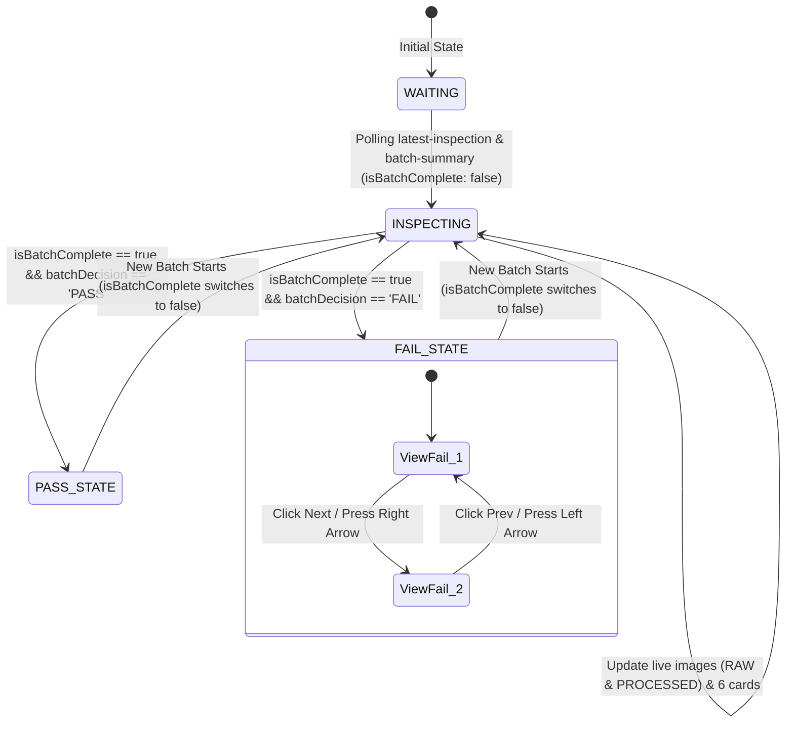

# ข้อกำหนดการเชื่อมต่อ i.MX8 PMI Frontend (REST API & Dual View Integration Spec)

เอกสารนี้สรุปข้อกำหนดการเชื่อมต่อระหว่าง **`backend_imx8`** กับหน้าจอ **Frontend i.MX8 (ส่วน PMI Display)** ผ่าน **REST API** เพื่อรองรับการแสดงผลแบบเรียลไทม์ และระบบเลื่อนดูเฉพาะภาพที่ FAIL เมื่อจบรอบการตรวจสอบ

---

## 1. ข้อมูลภาพและ Metadata ที่ต้องแสดงผล (6 Fields)

### จอแสดงผล 2 ฝั่ง (Dual View)
* **RAW VIEW (CAM_01)**: แสดงภาพต้นฉบับดั้งเดิมจาก `rawImageUrl` (เช่น `/visuals/raw_TR7A9073_X37Y2_S10_P15.jpg`)
* **PROCESSED VIEW (CAM_02)**: แสดงภาพผลลัพธ์จาก AI (Mask/Bounding Box) จาก `annotatedImageUrl` (เช่น `/visuals/annotated_TR7A9073_X37Y2_S10_P15.jpg`)

### ข้อมูล Metadata 6 ช่องใต้ภาพ
1. **DATE & TIME**: วันที่และเวลา เช่น `2026-05-05 11:46:49` (`dateTime`)
2. **XY COORDINATE**: พิกัด Die เช่น `X37Y2` (`xyCoord`)
3. **BATCH # - WAFER #**: รหัส Batch และ Wafer เช่น `TR7A9073-W25C5` (`batch` - `waferNo`)
4. **SITE # / PAD #**: ข้อมูลตำแหน่ง Site และ Pad เช่น `S10 / P15` (`site` / `pad`)
5. **PRODUCT SETUP FILE**: ชื่อไฟล์ Configuration ของผลิตภัณฑ์ เช่น `29D5B0FBAA-PC611` (`productSetup`)
6. **TEMP**: อุณหภูมิการทดสอบ เช่น `300` หรือ `30.0°C` (`temp`)
*(ฟิลด์เสริม: `reason` ระบุสาเหตุความผิดปกติ เช่น `Probe Mark Close to Edge`, `Big Probe Mark`)*

---

## 2. โครงสร้าง REST API Endpoints (i.MX8 Node: Port 8001)

### 📡 1. ดึงข้อมูลภาพตรวจล่าสุด (Live Inspection / Polling)
* **Endpoint**: `GET /api/latest-inspection` (หรือ `GET /api/v1/latest-inspection`)
* **Response (JSON)**:
```json
{
  "decision": "PASS",
  "reason": "-",
  "rawImageUrl": "/api/images/raw/TR7A9073/TR7A9073_X37Y2_S10_P15.jpg",
  "annotatedImageUrl": "/api/images/annotated/TR7A9073/TR7A9073_X37Y2_S10_P15.jpg",
  "dateTime": "2026-05-05 11:46:49",
  "xyCoord": "X37Y2",
  "waferNo": "TR7A9073-W25C5",
  "batch": "TR7A9073",
  "site": "S10",
  "pad": "P15",
  "productSetup": "29D5B0FBAA-PC611",
  "temp": "300"
}
```

---

### 📡 2. ดึงสถานะสรุปของ Batch ปัจจุบัน (Batch Summary & Fail Navigation)
* **Endpoint**: `GET /api/batch-summary` (หรือ `GET /api/v1/batch-summary`)
* **Response (เมื่อรอบจบ / พบสัญญาณ `.END.bmp`)**:
```json
{
  "isBatchComplete": true,
  "batchDecision": "FAIL",
  "totalImages": 35,
  "failCount": 2,
  "batch": "TR7A9073",
  "waferNo": "TR7A9073-W25C5",
  "mask": "02000008",
  "txtFile": "FAIL_02000008_PROBER01_20260505115000.txt",
  "failedRecords": [
    {
      "decision": "FAIL",
      "reason": "Probe Mark Close to Edge",
      "rawImageUrl": "/api/images/raw/TR7A9073/TR7A9073_X37Y2_S10_P15.jpg",
      "annotatedImageUrl": "/api/images/annotated/TR7A9073/TR7A9073_X37Y2_S10_P15.jpg",
      "dateTime": "2026-05-05 11:46:49",
      "xyCoord": "X37Y2",
      "waferNo": "TR7A9073-W25C5",
      "batch": "TR7A9073",
      "site": "S10",
      "pad": "P15",
      "productSetup": "29D5B0FBAA-PC611",
      "temp": "300"
    }
  ]
}
```

* **Response (ระหว่างกำลังตรวจ / ยังไม่เจอรอบจบ)**:
```json
{
  "isBatchComplete": false,
  "batchDecision": "PASS",
  "totalImages": 12,
  "failCount": 0,
  "failedRecords": [],
  "batch": "TR7A9073",
  "waferNo": "TR7A9073-W25C5"
}
```

---

### 📡 3. สั่งรีเซ็ตสถานะ Batch (Manual Reset)
* **Endpoint**: `POST /api/batch/reset` (หรือ `POST /api/v1/batch/reset`)
* **Response (JSON)**:
```json
{
  "status": "success",
  "message": "Batch state reset successfully"
}
```
*(หมายเหตุ: ระบบมี **Auto-Reset** อยู่แล้ว เมื่อภาพแรกของแผ่นถัดไปเข้ามา ระบบจะเคลียร์ผลแผ่นเก่าและเริ่มนับ 1 ใหม่โดยอัตโนมัติ)*

---

## 3. ตรรกะการทำงานฝั่ง Frontend (State & Logic Workflow)



### 1. ระหว่างกำลังตรวจ (Streaming / In-Progress Phase)
* แถบ Banner แสดงสถานะ **`INSPECTING`** (หรือสถานะของภาพล่าสุด)
* จอภาพ `RAW VIEW`, `PROCESSED VIEW` และการ์ด 6 ช่องด้านล่างอัปเดตตามภาพที่เข้ามาแบบเรียลไทม์

### 2. เมื่อสิ้นสุดรอบ (Batch Complete: `isBatchComplete === true`)
* **กรณี `batchDecision === "PASS"`**:
  * แถบด้านบนเปลี่ยนเป็นสีเขียว **`PASS`**
  * ค้างหน้าจอไว้ที่ภาพและข้อมูลล่าสุดที่ประมวลผลเสร็จ
* **กรณี `batchDecision === "FAIL"`**:
  * แถบด้านบนเปลี่ยนเป็นสีแดง **`FAIL`**
  * สลับเข้าสู่โหมด **Fail Carousel / Navigation**:
    * แสดงปุ่มเลื่อน **`◀ Prev`** และ **`Next ▶`** (พร้อมตัวบอกตำแหน่ง เช่น `1 / 3`)
    * รองรับการกดลูกศรคีย์บอร์ด `←` / `→`
    * เมื่อผู้ใช้เลื่อนดูภาพที่ FAIL: ทั้ง **RAW VIEW**, **PROCESSED VIEW** และ **การ์ดข้อมูล 6 ช่องใต้ภาพ** จะเปลี่ยนตาม `failedRecords[index]` ที่เลือกทันที

---

## 4. หมายเหตุเกี่ยวกับไฟล์และพื้นที่จัดเก็บใน Production จริง

1. **Drive M (โรงงาน)**: ภาพดิบจะถูกจัดเก็บถาวรไว้ที่ `M:\WP288\PMI\PROCESSED\{lotNo}` และภาพผลตรวจจะบันทึกที่ `M:\WP288\PMI\OUTPUT\{lotNo}`
2. **Drive N (โรงงาน)**: เครื่อง Prober ส่งภาพเข้าที่ `N:\WP288\PMI\IMAGE` และรับผลสรุปการตัดสินที่ `N:\WP288\PMI\JUDGE`
3. **Frontend Base URL**: Frontend สามารถเรียก URL ภาพโดยเอา Host Base URL (เช่น `http://10.42.0.95:8001` หรือ `http://localhost:8001`) มาต่อหน้า `rawImageUrl` และ `annotatedImageUrl` ได้ทันที
