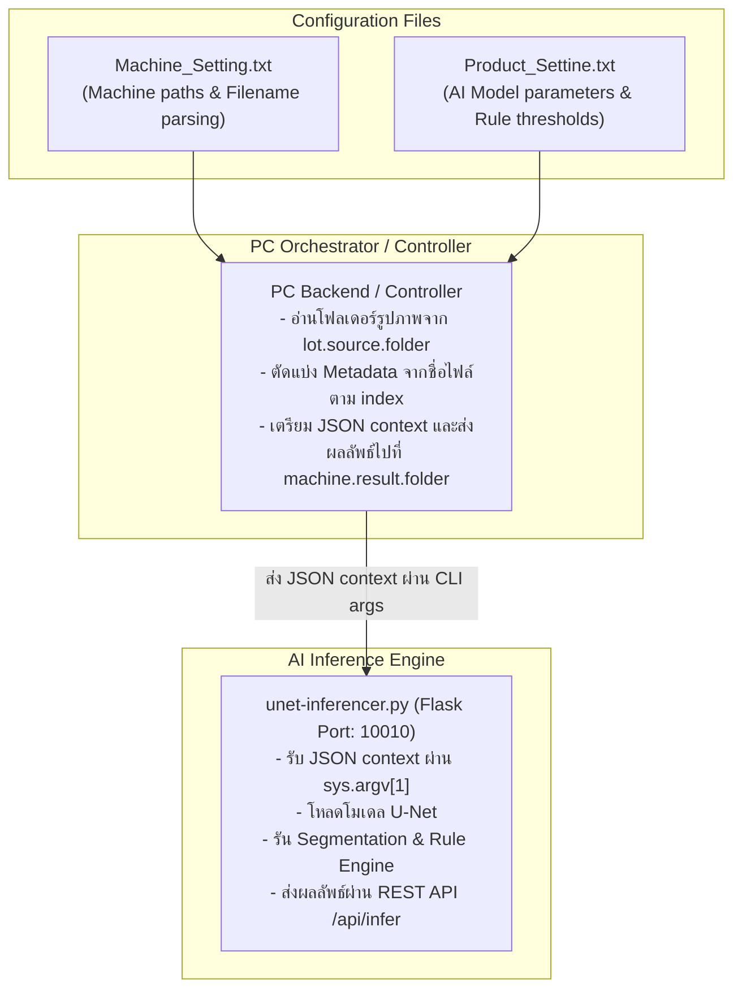

# การวิเคราะห์การเชื่อมโยงคอนฟิก (U-Net Inferencer & Machine / Product Settings)

เอกสารนี้สรุปรายละเอียดการดึงค่าคอนฟิกจาก [`Product_Settine.txt`](file:///home/nxp1/Desktop/PUNPUNJA/PROJECT/UIIU/Product_Settine.txt) และ [`Machine_Setting.txt`](file:///home/nxp1/Desktop/PUNPUNJA/PROJECT/UIIU/Machine_Setting.txt) ไปใช้งานใน [`unet-inferencer.py`](file:///home/nxp1/Desktop/PUNPUNJA/PROJECT/UIIU/unet-inferencer.py) และระบบ PC Controller

---

## 1. สถาปัตยกรรมการทำงาน (Architecture Flow)

> [!NOTE]
> `unet-inferencer.py` ไม่ได้เปิดอ่านไฟล์ `.txt` ด้วยโค้ดภายในตรงๆ แต่รับค่าทั้งหมดผ่าน `sys.argv[1]` (JSON string `context`) ที่ถูกเตรียมและส่งมาจากระบบ Orchestrator ชั้นนอก

---

## 2. พารามิเตอร์ที่ดึงจาก `Product_Settine.txt` ไปใช้ใน `unet-inferencer.py`

| พารามิเตอร์ใน `Product_Settine.txt` | ตำแหน่งใน `unet-inferencer.py` | คำอธิบายและหน้าที่ |
|---|---|---|
| **`classNames`** | บรรทัด 871 (`CLASS_NAMES`) | รายชื่อคลาสของโมเดล: `["pad", "probemark"]` |
| **`padIndex`** | บรรทัด 1200 (`pad_index`) | Index ของคลาสที่ระบุว่าเป็น Pad (ค่ามาตรฐาน: `0`) |
| **`padShape`** | บรรทัด 618 (`context["padShape"]`) | รูปทรงของ Pad เช่น `"rectangle"` จะวาดกรอบสี่เหลี่ยม |
| **`badLabels`** | บรรทัด 872 (`bad_labels`) | รายชื่อ Label ที่นับเป็นข้อบกพร่อง `["bad", "defect"]` |
| **`thingColors`** | บรรทัด 881, 960 (`thing_colors`) | รหัสสี BGR/HEX สำหรับวาด Mask และ Bounding Box (`#FF0000`, `#00FF00`) |
| **`minAreaSizes`** | บรรทัด 880 (`min_area_sizes`) | กรองขนาดพิกเซลขั้นต่ำของวัตถุแต่ละคลาสเพื่อตัดสัญญาณรบกวน (`[300, 10]`) |
| **`targetWidth` / `targetHeight`** | บรรทัด 939–941 (`target_width`, `target_height`) | ขนาดภาพเป้าหมายสำหรับ Resize ก่อนส่งเข้าโมเดลและตัด ROI (`160x160`) |
| **`verticalRoi` / `horizontalRoi`** | บรรทัด 944–948 (`vertical_roi`, `horizontal_roi`) | ขอบเขตพื้นที่ตรวจสอบ (Region of Interest) จากกึ่งกลางภาพ เช่น `0.7` (70%) |
| **`edgeThreshold`** | บรรทัด 893, 508, 710 (`edge_threshold`) | ระยะห่างขั้นต่ำจาก Probemark ถึงขอบ Pad (เกณฑ์: `8.0` px/um) — **ต่ำกว่านี้ = FAIL** |
| **`edgeConversionFactor`** | บรรทัด 897, 503, 688 (`edge_conversion_factor`) | ตัวคูณแปลงระยะพิกเซลต่อหน่วยจริง (ค่ามาตรฐาน: `1.0`) |
| **`areaRatioThreshold`** | บรรทัด 885, 505, 700 (`area_ratio_threshold`) | สัดส่วนพื้นที่ Probemark ต่อ Pad สูงสุด (เกณฑ์: `25.0%`) — **เกินนี้ = FAIL** |
| **`greyscaleThreshold`** | บรรทัด 901, 507, 716 (`greyscale_threshold`) | เกณฑ์ความเข้ม/ความมืดเฉลี่ยของรอยกดเข็ม (ค่ามาตรฐาน: `0` คือปิดใช้งาน) |
| **`generateOutput`** | บรรทัด 921 (`generate_output`) | สั่งให้วาดและบันทึกภาพผลลัพธ์ลงโฟลเดอร์ Output หรือไม่ (`true`) |
| **`combineOutput`** | บรรทัด 932, 843 (`combine_output`) | สั่งให้นำภาพต้นฉบับและภาพผลลัพธ์มาต่อกันแบบ Split Comparison หรือไม่ (`true`) |
| **`servicePort`** | บรรทัด 964, 1272 (`service_port`) | พอร์ตเครือข่ายสำหรับเปิด Flask Service (`10010`) |
| **`processor`** | บรรทัด 951 (`processor`) | พาธไปยังสคริปต์ Pre/Post Processing เพิ่มเติม (ถ้ามีไฟล์จะรันผ่าน `execfile`) |

---

## 3. พารามิเตอร์ใน `Machine_Setting.txt` (สำหรับระบบ PC Controller / Orchestrator)

| พารามิเตอร์ใน `Machine_Setting.txt` | ค่าที่ตั้งไว้ | คำอธิบายและหน้าที่ |
|---|---|---|
| **`input.index.processTime`** | `0` | ตำแหน่งของ Timestamp ในชื่อไฟล์ภาพ (ช่องที่ 0) |
| **`input.index.waferId`** | `1` | ตำแหน่งของ Wafer / Batch ID ในชื่อไฟล์ภาพ (ช่องที่ 1) |
| **`input.index.siteCoordinate`** | `2` | ตำแหน่งของ พิกัด XY (Die Coordinate) ในชื่อไฟล์ภาพ (ช่องที่ 2) |
| **`input.index.probecardSite`** | `3` | ตำแหน่งของ Probecard Site (เช่น S1, S2) ในชื่อไฟล์ภาพ (ช่องที่ 3) |
| **`input.index.padNo`** | `4` | ตำแหน่งของ Pad Number (เช่น P1, P24) ในชื่อไฟล์ภาพ (ช่องที่ 4) |
| **`input.index.detailInfo`** | `5` | ตำแหน่งของ Status / Description เดิมในชื่อไฟล์ภาพ (ช่องที่ 5) |
| **`input.index.device`** | `6` | ตำแหน่งของ Device / Product Setup Name ในชื่อไฟล์ภาพ (ช่องที่ 6) |
| **`input.index.temperature`** | `7` | ตำแหน่งของ Temperature ในชื่อไฟล์ภาพ (ช่องที่ 7) |
| **`lot.source.folder`** | `N:\WP288\PMI\IMAGE` | โฟลเดอร์ต้นทางที่ Prober Machine ส่งไฟล์รูปภาพเข้ามา |
| **`lot.input.folder`** | `M:\WP288\PMI\PROCESSED\{output.lotNo}` | โฟลเดอร์สำหรับเก็บภาพที่ถูกนำเข้าสู่คิวการประมวลผลแล้ว |
| **`lot.output.folder`** | `M:\WP288\PMI\OUTPUT\{output.lotNo}` | โฟลเดอร์สำหรับเก็บภาพผลลัพธ์การตรวจสอบ |
| **`machine.result.folder`** | `N:\WP288\PMI\JUDGE` | โฟลเดอร์ที่ระบบ AI ต้องสร้างไฟล์สรุปผลการตัดสิน TXT ส่งกลับให้เครื่องจักร |
| **`machine.result.fileFormat`** | `{output.result}_{output.code}_{output.machine}_{output.ts}.txt` | รูปแบบโครงสร้างชื่อไฟล์ผลการตัดสิน |
| **`process.end.timeout`** | `10000` | เวลา Timeout สูงสุดในการรอสัญญาณสิ้นสุดกระบวนการ (มิลลิวินาที) |
