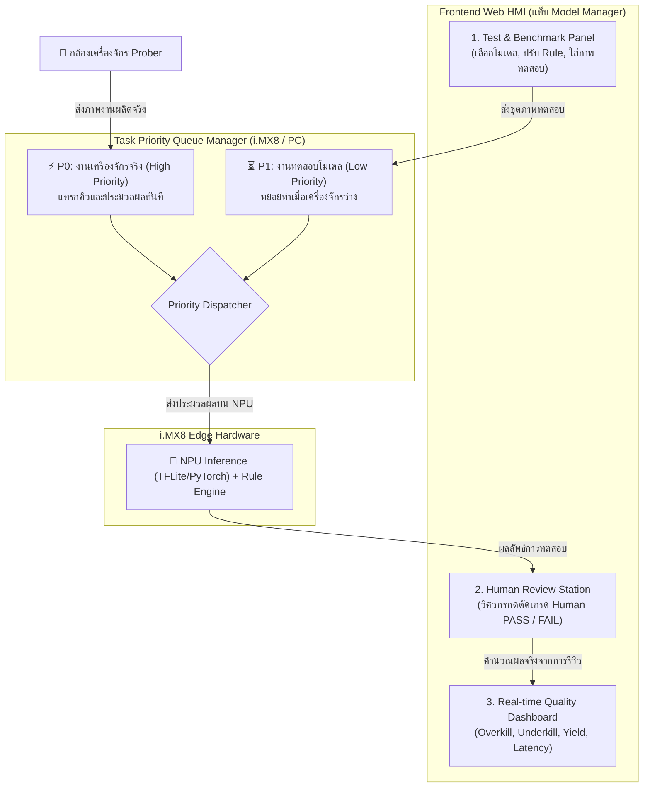

# 📑 แผนงานพัฒนา: Model Validation Lab & Human Review System with Priority Queue

เอกสารฉบับนี้สรุปแผนการพัฒนาฟีเจอร์ **ทดสอบวัดผลโมเดล (Model Validation & Benchmark)** บนหน้า HMI Dashboard โดยรันการประมวลผลบน **i.MX8 NPU** พร้อมระบบ **Priority Queue** เพื่อไม่ให้กระทบงานผลิตจริง

---

## 🎯 1. สรุปภาพรวมและสถาปัตยกรรม (Architecture Overview)

---

## 🛠️ 2. รายละเอียดสิ่งที่จะพัฒนาในแต่ละส่วน

### 1️⃣ ระบบจัดคิวตามลำดับความสำคัญ (Priority Queue Engine)
* **P0 (Real-time Production):** ภาพจากเครื่องจักร Prober จะได้สิทธิ์ประมวลผลทันทีเป็นอันดับ 1
* **P1 (Model Batch Testing):** ภาพทดสอบจากหน้าเว็บจะทยอยประมวลผลในพื้นหลังเฉพาะตอนที่เครื่องจักรว่าง
* **Preemption Safety:** ถ้ามีงานเครื่องจักรเข้ามาขณะที่กำลังรันภาพทดสอบอยู่ ระบบจะเคลียร์ภาพทดสอบปัจจุบันให้เสร็จ (100–150ms) แล้ว **สลับไปประมวลผลภาพเครื่องจักรทันทีก่อนเสมอ**

---

### 2️⃣ หน้าจอ UI บนเว็บ HMI (`frontend/src/App.jsx`)
เพิ่มแท็บย่อย **`MODEL VALIDATION & REVIEW LAB`** ในหน้า Model Manager:

1. **แผงตั้งค่าและสั่งรันการทดสอบ (Test Setup Panel):**
   - เลือกรุ่นโมเดลที่ต้องการทดสอบ (`unet.tflite`, `unet_pytorch_3class.pth`)
   - จำลองเกณฑ์ Rule Engine (เช่น `Edge Limit: 8 px`, `Area Limit: 25%`)
   - เลือกชุดภาพทดสอบ (Folder / Upload)
   - ปุ่ม `[ START BENCHMARK ON i.MX8 ]`

2. **หน้าต่าง Human Review Station (สำหรับวิศวกรมาตัดเกรด):**
   - แสดงตารางภาพที่ประมวลผลเสร็จแล้วแบบเรียลไทม์
   - ปุ่มให้คนกด Confirm:
     - `[ ✅ Human PASS ]`
     - `[ ❌ Human FAIL ]`
   - คลิกที่แถวเพื่อเปิด **Split View Popup** ดูภาพเปรียบเทียบขนาดใหญ่ (Original vs AI Mask + จุดวัดระยะชิดขอบ)

3. **แผงสรุปผลคุณภาพจริง (Quality KPI Metrics):**
   - **Overkill Rate (%)** — คนบอก PASS แต่ AI ตัดสิน FAIL *(สูญเสียผลผลิตโดยไม่จำเป็น)*
   - **Underkill Rate (%)** — คนบอก FAIL แต่ AI ปล่อย PASS *(ของเสียหลุด ซึ่งอันตรายที่สุด)*
   - **Yield Rate (%)** — อัตราส่วนชิปที่ผ่าน
   - **AI-Human Agreement (%)** — ความแม่นยำที่ AI ตัดสินใจตรงกับมนุษย์
   - **Average Inference Latency** — ความเร็วเฉลี่ยบน i.MX8 NPU (ms)

---

### 3️⃣ ส่วน Backend API (`backend_imx8` & `backend_pc`)
1. **`POST /api/model/benchmark/start`** — รับชุดภาพทดสอบและจัดเข้าคิว Priority 1
2. **`GET /api/model/benchmark/progress`** — ส่งสถานะความคืบหน้า (เช่น `24/50 ภาพ`) และแจ้งเตือนสถานะคิว
3. **`POST /api/model/benchmark/save-review`** — บันทึกผลการกด Human Review ของคนลงฐานข้อมูล
4. **`GET /api/model/benchmark/report/:testId`** — ดึงสรุปรายงานเปรียบเทียบประสิทธิภาพของโมเดลแต่ละเวอร์ชัน
