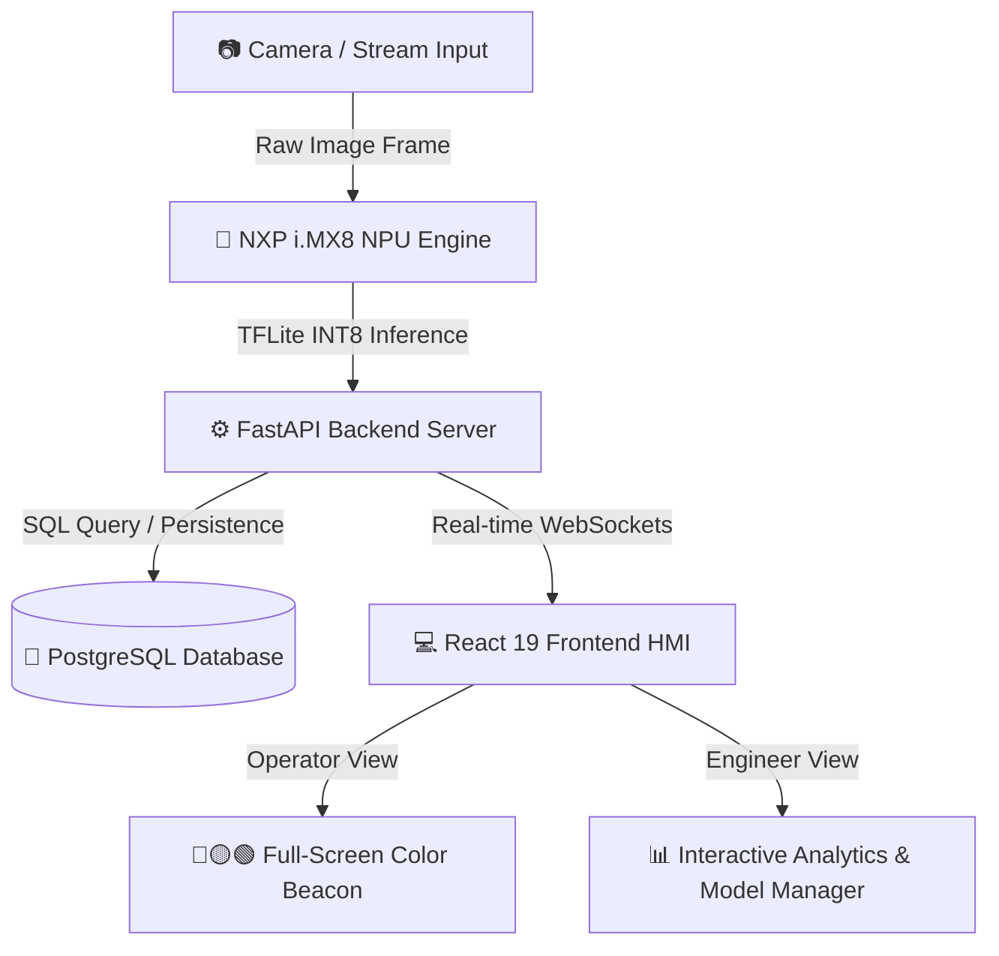

# 🔬 Edge AI Semiconductor Wafer Defect Inspection System
### ระบบตรวจจับและวิเคราะห์ตำหนิบนแผ่น semiconductor wafer ด้วยปัญญาประดิษฐ์ประมวลผลที่ขอบ (Edge AI)

---

## 📌 1. ภาพรวมระบบ (System Overview)

ระบบ **Edge AI Wafer Defect Inspection System** ถูกพัฒนาขึ้นสำหรับการตรวจจับตำหนิแบบเรียลไทม์บนแผ่นเวเฟอร์ (Semiconductor Wafer Inspection) ในกระบวนการผลิตสารกึ่งตัวนำ โดยใช้โมเดล Deep Learning (YOLOv8-Segmentation / UNet) ที่ถูกควอนไทซ์เป็น INT8 เพื่อประมวลผลบนหน่วยประมวลผล NPU (Neural Processing Unit) ของฮาร์ดแวร์ระดับอุตสาหกรรม **NXP i.MX8M Plus**

ระบบประกอบด้วยหน้าจอแสดงผล **HMI (Human-Machine Interface)** สองโหมดการทำงาน:
1. **Engineer Inspection Mode**: หน้าจอควบคุมละเอียดสำหรับวิศวกร (แสดงภาพถ่ายเปรียบเทียบ Overlay/Split, Telemetry ของ NPU, สถิติ Yield/Defect, การจัดการโมเดล AI และรายงาน Analytics)
2. **Operator Mode**: หน้าจอแสดงผลขนาดใหญ่สำหรับพนักงานคุมเครื่อง (แสดงแบนเนอร์ PASS/WARNING/FAIL ตัวหนา 56px พร้อมระบบเปลี่ยนสีธีมทั้งหน้าจอเป็นสัญญาณไฟเตือนแบบ Full-Screen Color Beacon มองเห็นได้จากระยะไกล)

---

## 🛠️ 2. สถาปัตยกรรมเทคโนโลยี (Tech Stack Breakdown & Justifications)

ระบบเลือกใช้เทคโนโลยีในแต่ละ Layer อย่างพิถีพิถันเพื่อตอบโจทย์ประสิทธิภาพความเร็วระดับเรียลไทม์ ความเสถียรในโรงงานอุตสาหกรรม และการตอบสนองที่ลื่นไหล:



### 💻 Frontend (Human-Machine Interface - HMI)
| Technology | Description | เหตุผลในการเลือกใช้ (Justification) |
| :--- | :--- | :--- |
| **React 19** | Core UI Library | ช่วยในการจัดการ Component-based State ที่ซับซ้อนได้อย่างมีประสิทธิภาพและลื่นไหล รองรับการ Re-render เฉพาะจุดที่มีการอัปเดตข้อมูลเรียลไทม์จาก WebSocket |
| **Vite 8** | Frontend Build Tool & Dev Server | ให้ความเร็วในการพัฒนาสูงมากด้วย Instant Hot Module Replacement (HMR) และการ bundling ที่รวดเร็ว เหมาะกับการพัฒนาแอปพลิเคชัน HMI ระดับอุตสาหกรรม |
| **Vanilla CSS** | Pure Custom Styling | หลีกเลี่ยง Heavy CSS Frameworks (เช่น Tailwind หรือ Bootstrap) เพื่อให้สามารถควบคุมสัดส่วนเลย์เอาต์ ความละเอียดของภาพ Canvas และระบบเปลี่ยนสีธีมทั้งหน้าจอ (Full-Screen Theme) ได้สมบูรณ์แบบ 100% โดยไม่มี Overhead |
| **HTML5 Canvas API** | Graphics Rendering Engine | ใช้สำหรับวาดภาพถ่ายแผ่นเวเฟอร์ เลเซอร์สแกนเนอร์ และการแสดงผล Overlay Bounding Box / Segmentation Masks พร้อมสเกลสัดส่วน 1:1 ได้อย่างคมชัดด้วยประสิทธิภาพ 60 FPS |

---

### ⚙️ Backend & Inference Engine
| Technology | Description | เหตุผลในการเลือกใช้ (Justification) |
| :--- | :--- | :--- |
| **FastAPI (Python 3.10+)** | High-performance Web Framework | เป็น Framework ที่เร็วกว่า Flask หลายเท่า สร้างบน Starlette/Pydantic รองรับ Asynchronous (async/await) เหมาะสำหรับรับส่งข้อมูลสตรีมมิ่งภาพและ Telemetry ความเร็วสูง |
| **Uvicorn** | ASGI Web Server | Server ที่รองรับการเชื่อมต่อแบบ Async ความเร็วสูง เหมาะสำหรับการทำ WebSocket Streaming แบบเรียลไทม์ระหว่าง Backend กับ HMI Frontend |
| **PyTorch & YOLOv8-Seg** | Deep Learning Framework & Model | ใช้ฝึกฝนและทำ Segmentation ตรวจจับแผ่น Pad, รอย Probe Mark และสิ่งปนเปื้อน (Silicon Grain / Dust) ด้วยความแม่นยำสูง (mAP > 97%) |
| **TensorFlow Lite (TFLite INT8)** | Edge Quantized Model Format | ทำการ Quantize โมเดลจาก PyTorch เป็น INT8 เพื่อให้สามารถรันบนฮาร์ดแวร์ NPU อุปกรณ์ริมขอบ (NXP i.MX8) ได้ที่ความเร็วระดับมิลลิวินาที (<17ms per frame) |
| **OpenCV (cv2)** | Image Processing Library | ใช้สำหรับประมวลผลภาพเบื้องต้น (Image Crop, Bounding Box Annotation, Edge Alignment) ก่อนส่งภาพเข้า AI โมเดล |

---

### 🐘 Data Persistence & Hardware
| Technology | Description | เหตุผลในการเลือกใช้ (Justification) |
| :--- | :--- | :--- |
| **PostgreSQL** | Enterprise Relational Database | ตอบโจทย์มาตรฐานโรงงานอุตสาหกรรมด้วยความสามารถในการรองรับข้อมูลธุรกรรม (Transactions) การบันทึกประวัติผลตรวจ (Inspection Logs) และความปลอดภัยของข้อมูลสูง |
| **SQLite (Fallback)** | Lightweight Embedded Database | ทำหน้าที่เป็นระบบสำรองอัตโนมัติ (Auto-fallback) เมื่อ PostgreSQL Offline เพื่อให้ระบบ HMI สามารถทำงานและบันทึกข้อมูลได้อย่างต่อเนื่องไม่สะดุด |
| **NXP i.MX8M Plus** | Edge AI Hardware Target | บอร์ดไมโครโพรเซสเซอร์ระดับอุตสาหกรรมพร้อม NPU ในตัว (2.3 TOPS) ใช้พลังงานต่ำ เหมาะสำหรับติดตั้งข้างสายการผลิตจริง |

---

## 🌟 3. ฟีเจอร์หลักของระบบ (Key Features)

1. **โหมดตรวจจับ 2 Classes & 3 Classes (Model Class Architecture Manager)**:
   - สลับใช้งานระหว่างโหมด 2 คลาส (`Pad + Probe Mark`) และ 3 คลาส (`Pad + Probe Mark + Silicon Grain`) ได้ทันที
   - ระบบตรวจสอบและสลับโหมดอัตโนมัติให้ตรงกับสถาปัตยกรรมของโมเดล AI ที่เปิดใช้งาน (`2C` / `3C`)
2. **การแสดงผล Operator Mode เต็มหน้าจอ (Full-Screen Color Beacon)**:
   - แบนเนอร์ผลลัพธ์ขนาดใหญ่ (`PASS`, `WARNING`, `FAIL`) ฟอนต์หนา 56px
   - พื้นหลังและส่วนประกอบทั้งหน้าจอเปลี่ยนสีตามผลลัพธ์ (เขียว/เหลือง/แดง) เป็นไฟสัญญาณเตือนทางสายตาจากระยะไกล
3. **การแสดงผลภาพถ่ายจริง 100% (No Fake Simulation)**:
   - แสดงเฉพาะภาพถ่ายจริงจากกล้องหรือไฟล์สตรีม
   - กรณีไม่มีสัญญาณภาพ หน้าจอจะแสดงข้อความเตือน **"NO IMAGE AVAILABLE"** พร้อมสถานะรอกล้องโดยไม่สร้างรูปภาพจำลองขึ้นมาเอง
4. **Synchronized Image & Banner Display**:
   - ระบบ Preload ภาพล่วงหน้าในหน่วยความจำ เพื่อให้อัปเดตรูปภาพ แถบผลลัพธ์สี และเส้นเลเซอร์สแกนพร้อมกันในเฟรมเดียว (Frame-Perfect Sync)
5. **ระบบวิเคราะห์และส่งออกรายงาน (Analytics & Spreadsheet Export)**:
   - คำนวณอัตรา Yield Rate, Defect Rate, ความแม่นยำเฉลี่ย และประวัติเวลา Inference (ms)
   - ส่งออกข้อมูลการผลิตย้อนหลังเป็นไฟล์สเปรดชีต CSV ได้ทันที

---

## 📂 4. โครงสร้างโฟลเดอร์ของโปรเจกต์ (Project Directory Structure)

```
UIIU/
├── backend_imx8/             # 🧠 [Edge AI Node] FastAPI Backend บน NXP i.MX8
│   ├── main.py               # Machine Shared Folder Pipeline, NPU AI & .txt Judgement Writer
│   ├── config.yaml           # i.MX8 Edge Configuration
│   └── start_imx8.sh         # Launcher Script สำหรับ i.MX8 Node (Port 8000)
├── backend_pc/               # 🪺 [Central Server Node] NestJS Backend บน PC
│   ├── src/                  # NestJS Modules, Controllers, Services & Socket.io Gateway
│   ├── package.json          # NestJS Dependencies
│   └── start_pc.sh           # Launcher Script สำหรับ PC Node (Port 3000)
├── frontend/                 # 💻 [HMI Dashboard] React 19 + Vite HMI Web App
├── simulation/               # Machine Shared Folders (image, process, output, judge)
├── start.sh / stop.sh        # One-Click System Launcher / Shutdown (Multi-Node)
└── README.md                 # System Documentation
```


---

## 🚀 5. วิธีการติดตั้งและเริ่มต้นใช้งานระบบ (Installation & System Startup Guide)

### ความต้องการของระบบ (Prerequisites)
- **Node.js**: v18.0.0 ขึ้นไป
- **Python**: v3.10 ขึ้นไป
- **PostgreSQL Database**: พอร์ต 5432 (บริการฐานข้อมูลหลัก หากไม่ได้เปิด ระบบจะสลับไปใช้ SQLite สำรองให้อัตโนมัติ)

---

### ⚡ สรุปคำสั่งเปิดใช้งานเต็มระบบ (Quick Full-System Launch)

#### **1. เปิดบริการ PostgreSQL Database**
```bash
cd /home/nxp1/Desktop/PUNPUNJA/PROJECT/UIIU
sudo docker compose up -d
```

#### **2. เปิดใช้งาน Backend Server (FastAPI + WebSocket + AI Rule Engine)**
เปิด **Terminal 1** ที่โฟลเดอร์ root ของโปรเจกต์:
```bash
cd /home/nxp1/Desktop/PUNPUNJA/PROJECT/UIIU
.venv/bin/python3 -m uvicorn backend.main:app --host 0.0.0.0 --port 8000
```
* Backend API จะรันที่ `http://localhost:8000` (Swagger UI: `http://localhost:8000/docs`)
* WebSocket Streaming ที่ `ws://localhost:8000/ws`

#### **3. เปิดใช้งาน Frontend HMI Dashboard (React 19 + Vite)**
เปิด **Terminal 2**:
```bash
cd /home/nxp1/Desktop/PUNPUNJA/PROJECT/UIIU/frontend
npm run dev
```
* HMI Web Application จะพร้อมใช้งานที่ `http://localhost:5173`

#### **4. เข้าใช้งานผ่าน Web Browser**
เปิดเว็บเบราว์เซอร์แล้วระบุ URL:
👉 **`http://localhost:5173`**

---

### 🛠️ การติดตั้งใหม่จากเริ่มต้น (First-Time Environment Setup)

หากย้ายเครื่องหรือติดตั้งใหม่ครั้งแรก ให้รันคำสั่งเตรียมสภาพแวดล้อมดังนี้:

1. **สร้าง Virtual Environment และติดตั้ง Python Dependencies**:
   ```bash
   python3 -m venv .venv
   .venv/bin/pip install fastapi uvicorn[standard] websockets psycopg2-binary opencv-python-headless pillow pydantic pyyaml python-multipart numpy torch torchvision ultralytics
   ```
2. **ติดตั้ง Node.js Dependencies สำหรับ Frontend**:
   ```bash
   cd frontend
   npm install
   ```

---

### 🔍 วิธีการตรวจสอบสถานะการทำงาน (Verification)
- **เช็กระบบฐานข้อมูลและ HMI Backend**: เข้าไปที่ `http://localhost:8000/api/sys-stats` จะต้องคืนค่า JSON `"db": "PostgreSQL"`
- **เช็กสถานะการเชื่อมต่อสตรีมมิ่งสด**: ที่หน้าเว็บ `http://localhost:5173` มุมขวาบนต้องแสดงสถานะ **`DB: POSTGRESQL`** และ **`EDGE: ONLINE`** พร้อมแสดงผลการสแกนแผ่นเวเฟอร์สด 1:1 แบบ Frame-Perfect Sync

## 📡 6. รายการ API Endpoints ที่สำคัญ

| Endpoint | Method | Protocol | Description |
| :--- | :--- | :--- | :--- |
| `/ws` | GET | WebSocket | สตรีมมิ่งข้อมูลการตรวจจับแบบเรียลไทม์ (`NEW_INSPECTION`) |
| `/api/latest-inspection` | GET | HTTP REST | ดึงข้อมูลผลการตรวจจับแผ่นเวเฟอร์ล่าสุด |
| `/api/history` | GET | HTTP REST | ดึงประวัติการตรวจจับทั้งหมดสำหรับตารางประวัติ |
| `/api/sys-stats` | GET | HTTP REST | ดึงข้อมูล Telemetry ของฮาร์ดแวร์ (CPU, NPU %, RAM, Temp) |
| `/api/models` | GET | HTTP REST | ดึงรายการโมเดล AI ที่ลงทะเบียนในระบบ |
| `/visuals/{filename}` | GET | HTTP Static | ดึงไฟล์ภาพถ่ายแผ่นเวเฟอร์จริงและการเน้นสัญลักษณ์ |

---

## 👨‍💻 7. สรุปผู้พัฒนาและข้อกำหนดการใช้งาน
- **พัฒนาขึ้นสำหรับ**: Semiconductor Wafer Quality Inspection Project
- **ระบบปฏิบัติการเป้าหมาย**: Linux / NXP i.MX8 Yocto Linux & Windows Development Environment
