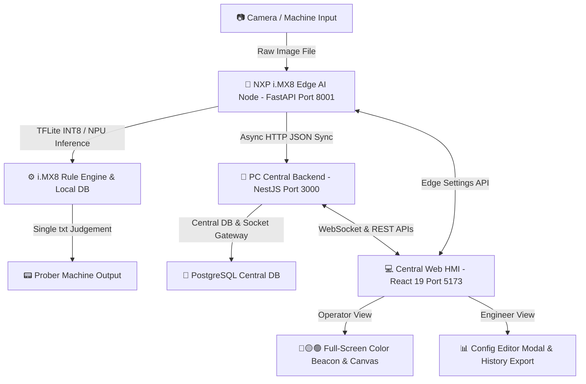

# 🔬 AI Wafer Inspection HMI Dashboard (Edge AI System)
### ระบบตรวจจับและวิเคราะห์ตำหนิบนแผ่น semiconductor wafer ด้วย Edge AI

---

## 📌 1. ภาพรวมระบบ (System Overview)

ระบบ **AI Wafer Inspection HMI Dashboard** ถูกพัฒนาขึ้นสำหรับการตรวจจับตำหนิแบบเรียลไทม์บนแผ่นเวเฟอร์ (Semiconductor Wafer Inspection) ในกระบวนการผลิตสารกึ่งตัวนำ โดยใช้โมเดล Deep Learning (YOLOv8-Segmentation / UNet) ในการประมวลผลบนหน่วยประมวลผลของฮาร์ดแวร์ระดับอุตสาหกรรม **NXP i.MX8M Plus** (Edge Node) ร่วมกับระบบเซิร์ฟเวอร์ศูนย์กลาง (PC Node) 

ระบบ HMI (Human-Machine Interface) นี้ได้รับการออกแบบให้มีความลื่นไหล เป็นมิตรต่อผู้ใช้งาน และรองรับหน้าจอสัมผัสในโรงงานอุตสาหกรรม พร้อมหน้าต่างควบคุม (Settings) ที่สามารถปรับแก้พารามิเตอร์ของระบบแบบ Hot-Reload ได้ทันที

---

## 🛠️ 2. สถาปัตยกรรมเทคโนโลยี (Tech Stack Architecture)

สถาปัตยกรรมของระบบแบ่งออกเป็น 3 ส่วนหลัก (3-Tier Dual-Node Architecture):


```mermaid
graph TD
    A[📷 Camera / Machine Input] -->|Raw Image File| B[🧠 NXP i.MX8 Edge AI Node - FastAPI Port 8001]
    B -->|TFLite INT8 / NPU Inference| C[⚙️ i.MX8 Rule Engine & Local DB]
    C -->|Single txt Judgement| D[📟 Prober Machine Output]
    B -->|Async HTTP JSON Sync| E[🪺 PC Central Backend - NestJS Port 3000]
    E -->|Central DB & Socket Gateway| F[🐘 PostgreSQL Central DB]
    E <-->|WebSocket & REST APIs| G[💻 Central Web HMI - React 19 Port 5173]
    B <-->|Edge Settings API| G
    G -->|Operator View| H[🔴🟡🟢 Full-Screen Color Beacon & Canvas]
    G -->|Engineer View| I[📊 Config Editor Modal & History Export]
```

### 💻 2.1 Frontend (HMI Web Dashboard)
- **React 19 + Vite 8**: สร้าง UI component ที่อัปเดตแบบเรียลไทม์ผ่าน WebSocket มีความเร็วสูงและ Hot Module Replacement
- **Vanilla CSS (Custom Design System)**: ออกแบบสไตล์เฉพาะตัวด้วย CSS Variables ควบคุมสเกล Typography (14px - 22px) และ Layout ได้สมบูรณ์ โดยไม่พึ่งพา Framework ที่มี Overhead
- **HTML5 Canvas API**: ใช้สำหรับวาดภาพถ่ายแผ่นเวเฟอร์ การวาด Bounding Box / Segmentation Masks พร้อมการคำนวณสเกลภาพแบบ 1:1

### ⚙️ 2.2 Edge AI Backend (NXP i.MX8 - FastAPI)
- **FastAPI (Python 3.10+)**: API ความเร็วสูงบนพอร์ต 8001 จัดการ Inference Pipeline, Telemetry ของ Edge Board และจัดการไฟล์ Config (Recipe/Machine)
- **PyTorch & TensorFlow Lite**: รันโมเดล Quantized INT8 บน NPU สำหรับตรวจจับ Pad, Probe Mark, และ Silicon Grain
- **OpenCV & NumPy**: จัดการ Image Processing แบบความหน่วงต่ำ

### 🪺 2.3 Central Server Backend (PC Node - NestJS)
- **NestJS (TypeScript)**: รันบนพอร์ต 3000 หน้าที่ประสานงาน (Gateway) ระหว่าง Edge Nodes หลายตัวและ HMI
- **PostgreSQL**: ฐานข้อมูล Enterprise (รันผ่าน Docker) เก็บประวัติผลตรวจจับ และสถิติการผลิต
- **SQLite (Fallback)**: ระบบฐานข้อมูลสำรองอัตโนมัติหาก PostgreSQL ดาวน์

---

## 🌟 3. ฟีเจอร์หลักของระบบ (Key Features)

1. **โหมดตรวจจับแบบไดนามิก (Model Class Architecture Manager)**:
   - ระบบจะอ่านค่าคลาสที่ตรวจจับได้จากโมเดล (`Pad + Probe Mark` 2C หรือเพิ่ม `Silicon Grain` 3C) และปรับการแสดงผลบน Canvas พร้อมตารางผลลัพธ์โดยอัตโนมัติ

2. **Full-Screen Operator Beacon & Frame-Perfect Sync**:
   - แบนเนอร์ผลลัพธ์ (PASS/WARNING/FAIL) เปลี่ยนสีพื้นหลังทั้งหน้าจอ เป็นสัญญาณไฟทางสายตา
   - Preload รูปภาพพร้อมกับการคำนวณ Bounding Box เพื่อให้การเรนเดอร์กราฟิกไม่กระตุก (No flickering)

3. **In-Browser Config Editor Modal (หน้า Settings)**:
   - ตารางรายการไฟล์ Recipe และ Machine Configuration
   - **Config Editor Modal**: เครื่องมือแก้ไขไฟล์ JSON แบบฝังในเบราว์เซอร์ พร้อมการเช็กความถูกต้อง (Valid JSON format) ปุ่ม Format JSON และระบบบันทึกแบบ Hot-Reload เข้าสู่ Runtime บน Edge ทันที
   - การจัดการเปิดใช้งานโมเดล AI (`.tflite` / `.pth`) ผ่านหน้า UI

4. **History & Analytics Export**:
   - ตารางประวัติการตรวจสอบย้อนหลังที่ดึงข้อมูลจาก Database แบบ Pagination
   - ระบบ **Export to CSV**: ดาวน์โหลดข้อมูลผลการตรวจสอบพร้อม timestamp เป็นไฟล์ Spreadsheet ชื่อไฟล์ฟอร์แมต `inspection_history_YYYY-MM-DD_HHMM.csv`

---

## 📂 4. โครงสร้างโฟลเดอร์ (Project Directory Structure)

```text
UIIU/
├── docs/                     # 📚 เอกสารเทคนิค สถาปัตยกรรม และคู่มือระบบ
├── backend_imx8/             # 🧠 [Edge AI Node] FastAPI Backend บน i.MX8 (Port 8001)
│   ├── configs/              # โฟลเดอร์เก็บ Machine & Recipe Configuration Files (JSON/TXT)
│   ├── models/               # ไฟล์โมเดล AI (เช่น best_converted_2c.tflite)
│   ├── simulation/           # ไฟล์จำลองสัญญาณจากเครื่องจักร
│   └── main.py               # จุดเริ่มรัน FastAPI Edge Server
├── backend_pc/               # 🪺 [Central Server Node] NestJS Backend บน PC (Port 3000)
│   ├── src/                  # NestJS Controllers, Services & Websocket Gateway
│   └── package.json          # Dependency ของ NestJS
├── frontend/                 # 💻 [HMI Dashboard] React 19 + Vite HMI Web App (Port 5173)
│   ├── src/
│   │   ├── components/       # UI Components เช่น ConfigEditorModal, Canvas
│   │   ├── pages/            # หน้าจอหลัก (Inspect, History, Models, Settings)
│   │   └── context/          # Context API สำหรับจัดการ State (InspectionContext)
│   └── index.html
├── datasets/                 # ข้อมูลชุดภาพสำหรับ Benchmark
├── docker/                   # การตั้งค่า Docker Container (PostgreSQL, CloudBeaver)
├── start.sh / stop.sh        # สคริปต์เปิด/ปิดระบบแบบครบวงจร
└── README.md                 # เอกสารที่คุณกำลังอ่าน
```

---

## 🚀 5. วิธีการติดตั้งและเริ่มต้นใช้งาน (Installation & Quick Start)

### ความต้องการของระบบ (Prerequisites)
- **Node.js**: v18.0.0+
- **Python**: v3.10+
- **Docker & Docker Compose**: สำหรับรัน PostgreSQL

---

### ⚡ สรุปคำสั่งเปิดใช้งานเต็มระบบ 3 ขั้นตอน

เพื่อจำลองการทำงานบนเครื่องเดียว (Development Mode) ให้เปิด Terminal 3 หน้าต่าง:

**Terminal 1: รัน Database & Central Backend (PC Node - Port 3000)**
```bash
cd /home/nxp1/Desktop/PUNPUNJA/PROJECT/UIIU
# เปิดฐานข้อมูล PostgreSQL
sudo docker compose up -d

# เปิด NestJS Server
cd backend_pc
npm install
npm run start:dev
```

**Terminal 2: รัน Edge AI Backend (i.MX8 Node - Port 8001)**
```bash
cd /home/nxp1/Desktop/PUNPUNJA/PROJECT/UIIU
# รัน FastAPI (ถ้าใช้ Virtual Environment อย่าลืม source ก่อนรัน)
.venv/bin/python3 -m uvicorn backend_imx8.main:app --host 0.0.0.0 --port 8001 --reload
```
* API Server รันที่ `http://localhost:8001` (เช็ก API Docs ได้ที่ `http://localhost:8001/docs`)

**Terminal 3: รัน HMI Frontend (React Dashboard - Port 5173)**
```bash
cd /home/nxp1/Desktop/PUNPUNJA/PROJECT/UIIU/frontend
npm install
npm run dev
```
* เข้าใช้งาน Web HMI ได้ที่: 👉 **`http://localhost:5173`**

---

## 📡 6. รายการ API Endpoints (Core Interfaces)

| Component | Endpoint | Method | Protocol | Description |
| :--- | :--- | :--- | :--- | :--- |
| **Edge Node** | `/api/sys-stats` | GET | REST | ข้อมูล Telemetry ฮาร์ดแวร์ (CPU, RAM) |
| **Edge Node** | `/api/configs/{type}` | GET/POST | REST | อ่านหรือบันทึกไฟล์ Recipe / Machine Config |
| **Edge Node** | `/api/models` | GET/POST | REST | รายการ AI Models ที่ใช้งานได้ |
| **PC Node** | `/api/history` | GET | REST | ดึงประวัติการตรวจจับจาก Database แบบ Pagination |
| **PC Node** | `/ws` | SUB | WebSocket | สตรีมมิ่งผลตรวจจับใหม่แบบเรียลไทม์ให้ Frontend |

---

## 👨‍💻 7. การพัฒนาและการจัดการ Git

โปรเจกต์นี้ถูกจัดการผ่าน GitHub Repository ผู้พัฒนาควรยึดหลักดังนี้:
- **Git Commit Standards**: ใช้ Conventional Commits เช่น `feat:`, `fix:`, `style:`, `refactor:`
- **Typography & Styling**: หากมีการแก้ไข UI ควรยึดขนาดอักษร (Typography Scale) ตามที่กำหนดไว้ใน `index.css` และควรดูความเรียบร้อยทั้งในหน้าจอขนาดเล็กและหน้าจอ HMI แบบ Full-HD (1920x1080)
- **Testing**: หากเพิ่มฟีเจอร์การคำนวณ Threshold หรือ Logic ฝั่ง Edge ต้องมีการทดสอบ Simulation เสมอ

*© 2026 NXP Semiconductors & Project Team. All Rights Reserved.*
