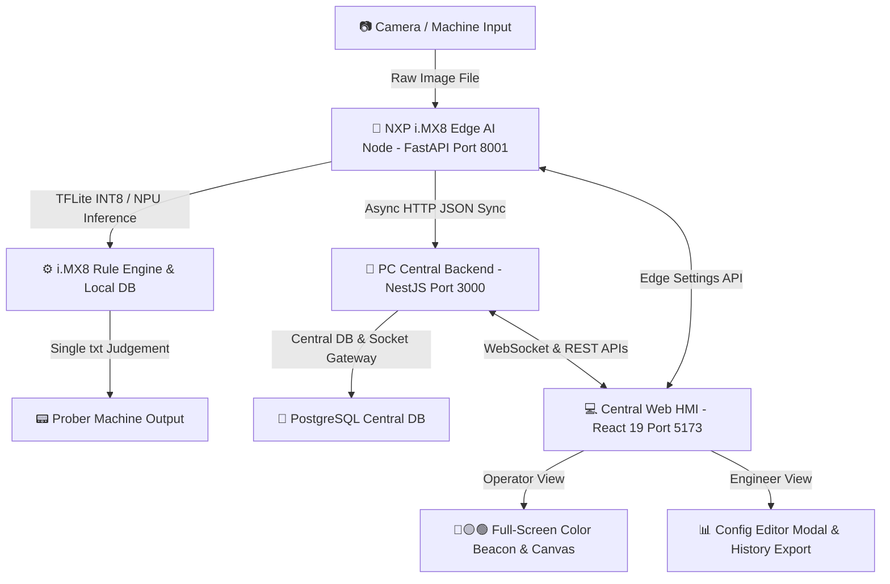

# 🔬 AI Wafer Inspection HMI Dashboard (Edge AI System)
### ระบบตรวจจับและวิเคราะห์ตำหนิบนแผ่น semiconductor wafer ด้วย Edge AI

---

## 📌 1. ภาพรวมระบบ (System Overview)

ระบบ **AI Wafer Inspection HMI Dashboard** ถูกพัฒนาขึ้นสำหรับการตรวจจับตำหนิแบบเรียลไทม์บนแผ่นเวเฟอร์ (Semiconductor Wafer Inspection) ในกระบวนการผลิตสารกึ่งตัวนำ โดยใช้โมเดล Deep Learning (YOLOv8-Segmentation / UNet) ในการประมวลผลบนหน่วยประมวลผลของฮาร์ดแวร์ระดับอุตสาหกรรม **NXP i.MX8M Plus** (Edge Node) ร่วมกับระบบเซิร์ฟเวอร์ศูนย์กลาง (PC Node) 

ระบบ HMI (Human-Machine Interface) นี้ได้รับการออกแบบให้มีความลื่นไหล เป็นมิตรต่อผู้ใช้งาน และรองรับหน้าจอสัมผัสในโรงงานอุตสาหกรรม พร้อมหน้าต่างควบคุม (Settings) ที่สามารถปรับแก้พารามิเตอร์ของระบบแบบ Hot-Reload ได้ทันที

---

## 🛠️ 2. สถาปัตยกรรมเทคโนโลยี (Tech Stack Architecture)

สถาปัตยกรรมของระบบแบ่งออกเป็น 3 ส่วนหลัก (3-Tier Dual-Node Architecture):


```mermaid
graph TD
    A[📷 Camera / Machine Input] -->|Raw Image File| B[🧠 NXP i.MX8 Edge AI Node - FastAPI Port 8001]
    B -->|TFLite INT8 / NPU Inference| C[⚙️ i.MX8 Rule Engine & Local DB]
    C -->|Single txt Judgement| D[📟 Prober Machine Output]
    B -->|Async HTTP JSON Sync| E[🪺 PC Central Backend - NestJS Port 3000]
    E -->|Central DB & Socket Gateway| F[🐘 PostgreSQL Central DB]
    E <-->|WebSocket & REST APIs| G[💻 Central Web HMI - React 19 Port 5173]
    B <-->|Edge Settings API| G
    G -->|Operator View| H[🔴🟡🟢 Full-Screen Color Beacon & Canvas]
    G -->|Engineer View| I[📊 Config Editor Modal & History Export]
```

### 💻 2.1 Frontend (HMI Web Dashboard)
- **React 19 + Vite 8**: สร้าง UI component ที่อัปเดตแบบเรียลไทม์ผ่าน WebSocket มีความเร็วสูงและ Hot Module Replacement
- **Vanilla CSS (Custom Design System)**: ออกแบบสไตล์เฉพาะตัวด้วย CSS Variables ควบคุมสเกล Typography (14px - 22px) และ Layout ได้สมบูรณ์ โดยไม่พึ่งพา Framework ที่มี Overhead
- **HTML5 Canvas API**: ใช้สำหรับวาดภาพถ่ายแผ่นเวเฟอร์ การวาด Bounding Box / Segmentation Masks พร้อมการคำนวณสเกลภาพแบบ 1:1

### ⚙️ 2.2 Edge AI Backend (NXP i.MX8 - FastAPI)
- **FastAPI (Python 3.10+)**: API ความเร็วสูงบนพอร์ต 8001 จัดการ Inference Pipeline, Telemetry ของ Edge Board และจัดการไฟล์ Config (Recipe/Machine)
- **PyTorch & TensorFlow Lite**: รันโมเดล Quantized INT8 บน NPU สำหรับตรวจจับ Pad, Probe Mark, และ Silicon Grain
- **OpenCV & NumPy**: จัดการ Image Processing แบบความหน่วงต่ำ

### 🪺 2.3 Central Server Backend (PC Node - NestJS)
- **NestJS (TypeScript)**: รันบนพอร์ต 3000 หน้าที่ประสานงาน (Gateway) ระหว่าง Edge Nodes หลายตัวและ HMI
- **PostgreSQL**: ฐานข้อมูล Enterprise (รันผ่าน Docker) เก็บประวัติผลตรวจจับ และสถิติการผลิต
- **SQLite (Fallback)**: ระบบฐานข้อมูลสำรองอัตโนมัติหาก PostgreSQL ดาวน์

---

## 🌟 3. ฟีเจอร์หลักของระบบ (Key Features)

1. **โหมดตรวจจับแบบไดนามิก (Model Class Architecture Manager)**:
   - ระบบจะอ่านค่าคลาสที่ตรวจจับได้จากโมเดล (`Pad + Probe Mark` 2C หรือเพิ่ม `Silicon Grain` 3C) และปรับการแสดงผลบน Canvas พร้อมตารางผลลัพธ์โดยอัตโนมัติ

2. **Full-Screen Operator Beacon & Frame-Perfect Sync**:
   - แบนเนอร์ผลลัพธ์ (PASS/WARNING/FAIL) เปลี่ยนสีพื้นหลังทั้งหน้าจอ เป็นสัญญาณไฟทางสายตา
   - Preload รูปภาพพร้อมกับการคำนวณ Bounding Box เพื่อให้การเรนเดอร์กราฟิกไม่กระตุก (No flickering)

3. **In-Browser Config Editor Modal (หน้า Settings)**:
   - ตารางรายการไฟล์ Recipe และ Machine Configuration
   - **Config Editor Modal**: เครื่องมือแก้ไขไฟล์ JSON แบบฝังในเบราว์เซอร์ พร้อมการเช็กความถูกต้อง (Valid JSON format) ปุ่ม Format JSON และระบบบันทึกแบบ Hot-Reload เข้าสู่ Runtime บน Edge ทันที
   - การจัดการเปิดใช้งานโมเดล AI (`.tflite` / `.pth`) ผ่านหน้า UI

4. **History & Analytics Export**:
   - ตารางประวัติการตรวจสอบย้อนหลังที่ดึงข้อมูลจาก Database แบบ Pagination
   - ระบบ **Export to CSV**: ดาวน์โหลดข้อมูลผลการตรวจสอบพร้อม timestamp เป็นไฟล์ Spreadsheet ชื่อไฟล์ฟอร์แมต `inspection_history_YYYY-MM-DD_HHMM.csv`

---

## 📂 4. โครงสร้างโฟลเดอร์ (Project Directory Structure)

โครงสร้างโฟลเดอร์ของโปรเจกต์ได้รับการออกแบบตามสถาปัตยกรรม 3-Tier แบบแยกโมดูลชัดเจน (Modular Microservices Architecture) เพื่อรองรับการทำงานแบบแยกระบบประมวลผล (Decoupled Edge and Central Services) ดังนี้:

### 4.1 แผนผังโฟลเดอร์ฉบับสมบูรณ์ (Complete Directory Tree)

```text
UIIU/
├── 📁 backend_imx8/                     # 🧠 [Edge AI Node] ส่วนประมวลผล AI และเชื่อมต่อเครื่องจักร (FastAPI, Port 8001)
│   ├── 📁 configs/                      # แฟ้มการตั้งค่าเครื่องจักรและสูตรการผลิต (Local Edge Cache)
│   │   ├── 📁 machines/                 # ไฟล์คอนฟิกเครื่องจักร (.txt / .json) เช่น Machine_Setting_WP269.txt
│   │   ├── 📁 recipes/                  # ไฟล์คอนฟิกชิ้นงาน/สูตรการตรวจ เช่น Product_Setting.txt
│   │   └── 📄 model_recipe_bindings.json# ตารางผูกความสัมพันธ์ระหว่าง Recipe และ AI Model
│   ├── 📁 core/                         # โมดูล Core Logic สำหรับการรัน AI และการคำนวณกฎการตรวจสอบ (Inspection Rules)
│   │   ├── 📁 configs/                  # ค่าคงที่และเกณฑ์มาตรฐาน
│   │   │   └── 📄 inspection_rules.yaml # ค่า Threshold และพารามิเตอร์การตัดสินชิ้นงาน
│   │   └── 📁 src/                      # Source code แกนหลัก
│   │       ├── 📁 rules/                # Rule-based Engine คำนวณขอบเขต, ระยะห่าง และการตัดสิน
│   │       │   ├── 📄 __init__.py
│   │       │   └── 📄 inspection.py     # ตรรกะตรวจสอบ Probe Mark บน Pad (Overlap, Margin, Area Ratio)
│   │       ├── 📁 unet/                 # โมดูล AI Segmentation (U-Net Architecture)
│   │       │   ├── 📄 __init__.py
│   │       │   ├── 📄 model.py          # โครงสร้าง U-Net Model Architecture
│   │       │   └── 📄 predict.py        # ฟังก์ชันเตรียมภาพ (Preprocess) และทำ Inference
│   │       └── 📁 utils/                # ยูทิลิตี้เสริม (Config Loader, Image Processing)
│   │           ├── 📄 __init__.py
│   │           └── 📄 config.py         # ฟังก์ชันโหลดไฟล์คอนฟิก YAML/JSON
│   ├── 📁 models/                       # พื้นที่จัดเก็บไฟล์โมเดล AI ที่พร้อมรันบน NPU
│   │   ├── 📄 active_model_info.json    # Metadata ของโมเดลปัจจุบัน (ชื่อ, วันที่, Input Resolution, Class Map)
│   │   ├── 📄 active_model.tflite       # โมเดลหลักที่กำลังรันอยู่ (.tflite รองรับ INT8 Quantization)
│   │   └── 📄 backup_model.tflite       # โมเดลสำรองกรณีโมเดลหลักมีปัญหา
│   ├── 📁 simulation/                   # สภาพแวดล้อมจำลองการแชร์โฟลเดอร์ของ Prober Machine
│   │   ├── 📁 benchmark_uploads/        # ข้อมูลชุดทดสอบ Benchmark ที่อัปโหลดผ่าน HMI
│   │   ├── 📁 drive_M/                  # ไดรฟ์จำลอง Samba Share M: (Output & Processed Images จากเครื่องจักร)
│   │   │   └── 📁 WP269/PMI/            # แยกโฟลเดอร์ตามหมายเลขเครื่องจักร (เช่น WP269)
│   │   │       ├── 📁 OUTPUT/           # โฟลเดอร์ที่เครื่องจักรส่งภาพใหม่เข้ามา
│   │   │       └── 📁 PROCESSED/        # โฟลเดอร์ย้ายภาพที่ตรวจสอบเสร็จแล้ว
│   │   └── 📁 drive_N/                  # ไดรฟ์จำลอง Samba Share N: (Image Archive & Judgement TXT)
│   │       └── 📁 WP269/PMI/
│   │           ├── 📁 IMAGE/            # คลังเก็บรูปภาพทั้งหมด
│   │           └── 📁 JUDGE/            # โฟลเดอร์เขียนไฟล์ผลตัดสิน (PASS/FAIL TXT) ให้ Prober นำไปใช้
│   ├── 📄 active_machine_setting.json   # แคชคอนฟิกเครื่องจักรปัจจุบันที่กำลังทำงาน
│   ├── 📄 active_product_setting.json   # แคชสูตรการผลิตปัจจุบันที่กำลังทำงาน
│   ├── 📄 config.yaml                   # ไฟล์ตั้งค่าเซิร์ฟเวอร์ พอร์ต พาธโฟลเดอร์ และ Hardware Watchdog
│   ├── 📄 main.py                       # จุดเริ่มต้นรัน FastAPI Server, File Watcher Loop, และ REST Endpoints
│   ├── 📄 mount_prober_shares.sh        # สคริปต์เชื่อมต่อเครือข่าย Samba (cifs mount) ไปยัง Prober จริง
│   ├── 📄 requirements.txt              # รายการ Python dependencies (FastAPI, OpenCV, NumPy, TFLite Runtime)
│   ├── 📄 run_unet_tflite_folder.py     # สคริปต์ Standalone สำหรับทดสอบรันโมเดลกับภาพทั้งโฟลเดอร์
│   └── 📄 setup_autostart_imx8.sh       # สคริปต์สร้าง systemd service ให้ Edge Node เปิดตัวเองอัตโนมัติตอนบูต
│
├── 📁 backend_pc/                       # 🪺 [Central Server Node] เซิร์ฟเวอร์ศูนย์กลางและการจัดการข้อมูล (NestJS, Port 3000)
│   ├── 📁 configs/                      # Master Storage สำหรับ Recipe & Machine Setting ทั่วทั้งโรงงาน
│   │   ├── 📁 machines/                 # ต้นฉบับคอนฟิกเครื่องจักรทั้งหมด
│   │   ├── 📁 recipes/                  # ต้นฉบับ Recipe ของผลิตภัณฑ์ทั้งหมด
│   │   └── 📄 model_recipe_bindings.json# ความสัมพันธ์การผูกโมเดลส่วนกลาง
│   ├── 📁 scripts/                      # สคริปต์ฝั่งเซิร์ฟเวอร์สำหรับแปลงโมเดล
│   │   ├── 📄 convert_model.py          # แปลงโมเดล PyTorch (.pth) สู่ ONNX / TensorFlow
│   │   └── 📄 convert_to_int8.py        # แปลงโมเดลเป็น TFLite INT8 Quantization พร้อม Calibration Dataset
│   ├── 📁 src/                          # โค้ดต้นฉบับ NestJS (TypeScript)
│   │   ├── 📁 configs/                  # โมดูลจัดการไฟล์ Configuration
│   │   │   ├── 📄 configs.controller.ts # REST API จัดการอ่าน/เขียน/ลบ/รีเนมไฟล์คอนฟิก
│   │   │   ├── 📄 configs.module.ts     # ลงทะเบียน Module
│   │   │   └── 📄 configs.service.ts    # ตรรกะจัดการไฟล์ระบบ และกระจาย (Sync) ไปยังเครื่อง Edge
│   │   ├── 📁 events/                   # โมดูลสื่อสารสองทางแบบ Real-time
│   │   │   ├── 📄 events.gateway.ts     # WebSocket Gateway (@WebSocketGateway) กระจายผลตรวจจับสู่ HMI
│   │   │   └── 📄 hardware-monitor.service.ts # มอนิเตอร์สถานะ Hardware (RAM, CPU, Disk)
│   │   ├── 📁 inspections/              # โมดูลประวัติการตรวจสอบชิ้นงาน
│   │   │   ├── 📄 inspection.entity.ts  # Database Schema / TypeORM Entity (PostgreSQL Table: inspections)
│   │   │   ├── 📄 inspections.controller.ts # REST Endpoints สำหรับดึงประวัติ และ Export CSV
│   │   │   └── 📄 inspections.service.ts# จัดการสืบค้น Query ข้อมูล คัดกรอง วันที่/Lot และบันทึก Record
│   │   ├── 📁 models/                   # โมดูลจัดการ AI Models
│   │   │   ├── 📄 models.controller.ts  # REST API อัปโหลด, ดึงรายการ, เปลี่ยนโมเดลที่ใช้งาน
│   │   │   ├── 📄 models.module.ts      # ลงทะเบียน Module
│   │   │   └── 📄 models.service.ts     # จัดการคัดลอกโมเดลไปยัง Edge Node
│   │   ├── 📁 training/                 # โมดูลควบคุมกระบวนการ Retrain โมเดล
│   │   │   ├── 📄 training.controller.ts# Endpoint เริ่มต้นการเทรน และตรวจสอบสถานะ
│   │   │   ├── 📄 training.module.ts    # ลงทะเบียน Module
│   │   │   └── 📄 training.service.ts   # ควบคุมการรัน Python Training Script แบบ Asynchronous
│   │   ├── 📄 app.module.ts             # Root Module เชื่อมต่อ Database, TypeORM, และ Submodules ทั้งหมด
│   │   └── 📄 main.ts                   # จุดเริ่มต้นรัน NestJS Application, ตั้งค่า CORS, และ Global Pipes
│   ├── 📄 nest-cli.json                 # การตั้งค่า NestJS CLI
│   ├── 📄 package.json                  # รายการ Dependencies (NestJS, TypeORM, Socket.IO, pg, rxjs)
│   ├── 📄 start_pc.sh                   # สคริปต์รันเซิร์ฟเวอร์แบบอัตโนมัติ
│   └── 📄 tsconfig.json                 # การตั้งค่า TypeScript Compiler
│
├── 📁 frontend/                         # 💻 [HMI Dashboard] หน้าจอเว็บแอปพลิเคชันสำหรับ Operator (React 19 + Vite, Port 5173)
│   ├── 📁 public/                       # Static Assets ของเบราว์เซอร์
│   │   ├── 📄 favicon.svg               # ไอคอน Favicon ของระบบ
│   │   ├── 📄 icons.svg                 # SVG Sprite Sheet สำหรับสัญลักษณ์ไอคอนต่างๆ
│   │   └── 📄 nxp_logo.webp             # โลโก้ NXP สำหรับส่วนหัวของหน้าจอ
│   ├── 📁 src/                          # โค้ดต้นฉบับ React Application
│   │   ├── 📁 assets/                   # ไฟล์กราฟิกและไอคอนประกอบ UI
│   │   ├── 📁 components/               # โมดูลหน้าต่างย่อย (Reusable UI Components & Modals)
│   │   │   ├── 📄 AuditLogModal.jsx     # หน้าต่างดูประวัติการเข้าใช้งานและการเปลี่ยนคอนฟิกระบบ
│   │   │   ├── 📄 BenchmarkReportModal.jsx # หน้าต่างรายงานผลการทดสอบความแม่นยำ (Benchmark Validation)
│   │   │   ├── 📄 ConfigEditorModal.jsx # โปรแกรมแก้ไขไฟล์ JSON/TXT ในเบราว์เซอร์ (In-browser Code Editor)
│   │   │   ├── 📄 ExportCSVModal.jsx    # หน้าต่างตัวเลือกการดาวน์โหลดข้อมูลผลการตรวจเป็นไฟล์ CSV
│   │   │   ├── 📄 HistoryDetailModal.jsx# หน้าต่างดูผลการตรวจแบบเจาะลึกรายชิ้นงาน พร้อมภาพขยาย
│   │   │   ├── 📄 ModelTrainingSubTab.jsx # แท็บควบคุมการเทรนโมเดลใหม่และการเลือกชุดข้อมูล
│   │   │   ├── 📄 SplitViewModal.jsx    # หน้าต่างเปรียบเทียบภาพ Raw เทียบกับภาพ Annotated แบบสองฝั่ง
│   │   │   └── 📄 WaferCanvas.jsx       # ตัวเรนเดอร์ภาพเวเฟอร์และ Bounding Box แบบ Frame-Perfect บน Canvas
│   │   ├── 📁 context/                  # State Management ส่วนกลางของแอปพลิเคชัน
│   │   │   └── 📄 InspectionContext.jsx # จัดการการเชื่อมต่อ WebSocket, เก็บผลตรวจล่าสุด, และแคชคอนฟิก
│   │   ├── 📁 layouts/                  # โครงสร้างเลย์เอาต์หน้าจอ
│   │   │   └── 📄 MainLayout.jsx        # เลย์เอาต์หลัก ประกอบด้วย Top Navigation Bar, Status Beacon และ Content Area
│   │   ├── 📁 pages/                    # หน้าจอหลักตามเส้นทาง (Route Pages)
│   │   │   ├── 📄 AnalyticsPage.jsx     # แดชบอร์ดสรุปผลเชิงสถิติ (Yield Trend, Defect Distribution Charts)
│   │   │   ├── 📄 HistoryPage.jsx       # หน้าตารางค้นหาประวัติการตรวจสอบย้อนหลัง พร้อมระบบ Filter และ Pagination
│   │   │   ├── 📄 InspectPage.jsx       # หน้าจอหลักแสดงผลตรวจจับแบบสด (Live Inspection View & Status Banner)
│   │   │   ├── 📄 ModelsPage.jsx        # หน้าจัดการโมเดล AI, ดูค่า Benchmark Accuracy และเริ่ม Retrain
│   │   │   └── 📄 SettingsPage.jsx      # หน้าตั้งค่าเครื่องจักร, จัดการสูตร Recipe และปรับแต่ง Threshold
│   │   ├── 📁 types/                    # ไฟล์กำหนด Type Definitions
│   │   │   └── 📄 inspection.ts         # TypeScript Interfaces สำหรับโครงสร้างข้อมูลการตรวจสอบ
│   │   ├── 📁 utils/                    # ฟังก์ชันช่วยเหลือและคำนวณสถิติ
│   │   │   ├── 📄 historyHelpers.js     # ฟังก์ชันจัดฟอร์แมตข้อมูลประวัติ และการ Export CSV
│   │   │   └── 📄 historyHelpers.test.js# ยูนิตเทสต์สำหรับตรวจสอบความถูกต้องของฟังก์ชันช่วยเหลือ
│   │   ├── 📄 App.css                   # สไตล์ชีตเฉพาะของคอมโพเนนต์หลัก
│   │   ├── 📄 App.jsx                   # จุดรวมเส้นทางหลักของแอป (React Router & Layout Wrapper)
│   │   ├── 📄 index.css                 # หัวใจหลักของดีไซน์ระบบ (CSS Custom Properties, Typography Scale, Dark Theme)
│   │   └── 📄 main.jsx                  # จุด Mount React Root เข้าสู่ DOM
│   ├── 📄 index.html                    # ไฟล์ HTML หลักของเว็บแอปพลิเคชัน
│   ├── 📄 package.json                  # รายการ Dependencies (React 19, Lucide Icons, Socket.IO Client, Vite)
│   └── 📄 vite.config.js                # การตั้งค่า Vite Build Tool และ Proxy สำหรับ Development
│
├── 📁 docs/                             # 📚 เอกสารเทคนิค สถาปัตยกรรม และคู่มือระบบอย่างละเอียด
│   ├── 📁 screenshots/                  # รูปภาพหน้าจอของระบบในแต่ละสถานะการทำงาน
│   ├── 📁 superpowers/plans/            # แผนงานการพัฒนาระบบและการออกแบบสถาปัตยกรรม
│   ├── 📄 FRONTEND_IMX8_DEV_GUIDE.md    # คู่มือการเชื่อมต่อระหว่าง Frontend และ i.MX8 Edge Node
│   ├── 📄 FUTURE_TRAINING_AND_VALIDATION_PLAN.md # แผนงานพัฒนาระบบเทรน AI และระบบตรวจสอบความถูกต้องในอนาคต
│   ├── 📄 IMX8_PMI_FRONTEND_INTEGRATION_PLAN.md  # สถาปัตยกรรมการผสานระบบ HMI เข้ากับเครื่องจักร PMI
│   ├── 📄 INFERENCER_CONFIG_ANALYSIS.md # บทวิเคราะห์โครงสร้าง Configuration ของระบบ Inference
│   ├── 📄 inspection_rules_summary.md   # กฎเกณฑ์และสมการทางคณิตศาสตร์ในการตัดสินคุณภาพชิ้นงาน (Pass/Fail Rules)
│   ├── 📄 MODEL_VALIDATION_LAB_PLAN.md  # คู่มือการทดสอบวัดประสิทธิภาพโมเดลในห้องปฏิบัติการ
│   └── 📄 MULTI_MACHINE_1_TO_N_ARCHITECTURE_PLAN.md # พิมพ์เขียวสถาปัตยกรรม 1 Central Server คุม N Edge Nodes
│
├── 📁 docker/                           # 🐳 คอนฟิกูเรชัน Docker สำหรับรันโครงสร้างพื้นฐานระบบเซิร์ฟเวอร์
│   ├── 📁 cbdata/                       # ข้อมูลการตั้งค่าระบบ CloudBeaver (Web-based Database GUI)
│   └── 📁 pgdata/                       # ไดเรกทอรีเก็บข้อมูลถาวรของฐานข้อมูล PostgreSQL 15 (Persistent Volume)
│
├── 📁 datasets/                         # 📦 ชุดข้อมูลภาพตัวอย่างสำหรับทดสอบโมเดลและการรัน Benchmark
├── 📁 outputs/                          # 📊 โฟลเดอร์เก็บผลลัพธ์การรันแบบออฟไลน์
│   ├── 📁 inspection_visuals/           # ภาพที่ตีกรอบแสดงผลลัพธ์การทดสอบ
│   └── 📄 inspection_report.csv         # ไฟล์สรุปผลการตรวจสอบแบบสเปรดชีต
│
├── 📄 docker-compose.yml                # คอนฟิกการเปิด Service ฐานข้อมูล (PostgreSQL & CloudBeaver) ด้วยคำสั่งเดียว
├── 📄 init.sql                          # สคริปต์ SQL สำหรับสร้างตาราง inspections และ indexes ตั้งแต่เริ่มรันฐานข้อมูล
├── 📄 start.sh                          # สคริปต์ Bash แบบ One-Click เพื่อเปิดระบบครบทุกโหนดพร้อมกัน (DB + PC + Edge + UI)
├── 📄 stop.sh                           # สคริปต์ Bash ปิดระบบและคืน Resource ทั้งหมดอย่างปลอดภัย
├── 📄 test_defect_mapping.py            # สคริปต์ทดสอบการจำลองแมปปิ้งจุดบกพร่อง
└── 📄 README.md                         # เอกสารภาพรวมและการใช้งานระบบที่คุณกำลังอ่าน
```

### 4.2 สรุปหน้าที่ของโฟลเดอร์หลักและความสัมพันธ์ระหว่างส่วนต่างๆ

| โฟลเดอร์ / ไดเรกทอรี | ภาษา / เทคโนโลยีหลัก | บทบาทและหน้าที่ในระบบ | ความสัมพันธ์กับระบบส่วนอื่น |
| :--- | :--- | :--- | :--- |
| **`backend_imx8/`** | Python 3.10+, FastAPI, OpenCV, TFLite | **Edge Node (AI & Machine Interface):** ตรวจจับภาพด้วยโมเดล U-Net บน NPU, คำนวณกฎการตัดสิน Pass/Fail, และเขียนผลตัดสินลงโฟลเดอร์แชร์ของ Prober | ส่งผลตรวจและ Telemetry ไปยัง `backend_pc` และส่งภาพพร้อมสถิติให้ `frontend` แสดงผล |
| **`backend_imx8/configs/`** | JSON, Text Config | **Local Config Cache:** เก็บค่าคอนฟิกเครื่องจักร (Machine Settings) และสูตรการผลิต (Product Recipes) | ซิงก์ข้อมูลกับ `backend_pc/configs/` และถูกเรียกใช้โดย Rule Engine ใน `core/src/rules/` |
| **`backend_imx8/core/`** | Python | **Inspection Rule Engine & U-Net Inference:** ตรรกะคณิตศาสตร์สำหรับวิเคราะห์ขอบเขต Probe Mark, เปอร์เซ็นต์พื้นที่ และจุดบกพร่อง | รับภาพจาก `main.py` ทำการประมวลผล แล้วส่งผลลัพธ์กลับให้ `main.py` นำไปบันทึกและส่งต่อ |
| **`backend_imx8/models/`** | TFLite (.tflite), JSON | **Edge AI Model Storage:** เก็บโมเดล AI น้ำหนักเบาที่ผ่านการแปลงเป็น INT8 Quantization เพื่อรันบน NPU | ได้รับโมเดลที่พร้อมใช้งานมาจาก `backend_pc/scripts/` |
| **`backend_imx8/simulation/`**| Shell, File Structure | **Virtual Prober Environment:** โฟลเดอร์จำลองไดรฟ์ M: และ N: สำหรับทดสอบโดยไม่ต้องต่อกับเครื่องจักรจริง | จำลองการส่งภาพจากกล้องเครื่องจักรเข้าสู่ระบบ |
| **`backend_pc/`** | TypeScript, NestJS, Node.js | **Central Server & Gateway:** เซิร์ฟเวอร์กลางสำหรับบันทึกประวัติลงฐานข้อมูล และกระจายข้อความ Real-time | รับข้อมูลจาก `backend_imx8` ผ่าน REST API และส่งต่อให้ `frontend` ผ่าน WebSocket |
| **`backend_pc/src/`** | NestJS (Modules/Services) | **Business Logic & Persistence:** จัดการ REST Endpoints, WebSocket Gateway (`events.gateway.ts`), และ Query ฐานข้อมูล | สื่อสารกับ PostgreSQL ผ่าน TypeORM และเชื่อมต่อไปยัง Web Browser Clients |
| **`backend_pc/scripts/`** | Python, PyTorch, TensorFlow | **Model Optimization Pipeline:** แปลงโมเดล PyTorch/ONNX ให้เป็น INT8 TFLite พร้อม Deploy สู่บอร์ด Edge | ส่งออกไฟล์ `.tflite` ไปยังโฟลเดอร์ `backend_imx8/models/` |
| **`frontend/`** | JavaScript (ES6+), React 19, Vite | **HMI Web Dashboard:** อินเทอร์เฟซควบคุมสำหรับผู้ใช้งาน แสดงภาพเวเฟอร์แบบเรียลไทม์ ปรับแต่งคอนฟิก และดูประวัติ | เชื่อมต่อ WebSocket กับ `backend_pc` และส่งคำสั่งควบคุม (REST) ไปที่ `backend_imx8` |
| **`frontend/src/components/`** | React Components | **UI Widgets & Interactive Modals:** คอมโพเนนต์หน้าต่างย่อย เช่น `ConfigEditorModal`, `WaferCanvas`, `ExportCSVModal` | ถูกเรียกใช้โดยหน้าจอหลักใน `frontend/src/pages/` |
| **`frontend/src/context/`** | React Context API | **Global State & Network Layer:** รวมศูนย์ State การตรวจจับ การเชื่อมต่อ WebSocket และฟังก์ชันการบันทึกคอนฟิก | กระจายข้อมูลผลตรวจจับและสถานะเครื่องจักรไปยังทุกหน้าจอในระบบ |
| **`docs/`** | Markdown, PNG Diagrams | **Technical Documentation:** รวบรวมเอกสารพิมพ์เขียว สถาปัตยกรรม 1:N, กฎเกณฑ์การตรวจสอบ และคู่มือนักพัฒนา | ใช้เป็นแนวทางอ้างอิงในการพัฒนาและต่อยอดฟังก์ชันการทำงาน |
| **`docker/`** | Docker, PostgreSQL 15, CloudBeaver | **Central Infrastructure:** จัดเก็บฐานข้อมูลประวัติการตรวจจับอย่างถาวรใน `pgdata` | ให้บริการฐานข้อมูลแก่ `backend_pc` ผ่าน Connection String บนพอร์ต 5432 |

### 4.3 ⚠️ โครงสร้างโฟลเดอร์เมื่อดึงจาก Git (ทำไมได้โฟลเดอร์มาไม่ครบ และสิ่งที่ต้องเตรียมเพิ่ม)

หากทำการ `git clone` โค้ดโปรเจกต์ลงบนเครื่องใหม่ แล้วสังเกตว่า **บางโฟลเดอร์หายไป หรือไม่มีไฟล์โมเดล AI** นั่นเป็นผลมาจากข้อจำกัดทางเทคนิคและนโยบายของระบบ 3 ประการ:

1. **ข้อจำกัดขนาดไฟล์ของ GitHub (>100MB)**:
   - ไฟล์น้ำหนักโมเดล AI เช่น `active_model.tflite` (~31MB), `backup_model.tflite` (~13MB) รวมถึงไฟล์ `.pt`, `.onnx`, `.pth` ถูกระบุไว้ใน `.gitignore` เพื่อไม่ให้พื้นที่ Git บวมและไม่ติด Policy ขนาดไฟล์ของ GitHub
   - **สิ่งที่ต้องทำ**: ต้องคัดลอกไฟล์โมเดล `active_model.tflite` มาวางในโฟลเดอร์ `backend_imx8/models/` ด้วยตนเอง
2. **รูปภาพ Wafer และไดรฟ์จำลอง (Simulation & Datasets)**:
   - ไฟล์รูปภาพดิบ `.bmp` จากเครื่องจักร Prober มีปริมาณหลายพันรูป (ขนาดรวมหลาย Gigabytes) จึงถูก `.gitignore` ไม่ให้ถูกผลักขึ้น Git
   - โฟลเดอร์ `backend_imx8/simulation/` และ `backend_imx8_test_finalbutnew/simulation/` จะถูกเก็บไว้เฉพาะโครงสร้างไดเรกทอรี (Directory Skeleton) ผ่านไฟล์ `.gitkeep` เพื่อให้ระบบไม่แครช
3. **พฤติกรรมดั้งเดิมของ Git ไม่เก็บโฟลเดอร์ว่าง (Empty Directories)**:
   - โฟลเดอร์ที่ไม่มีไฟล์อยู่เลยจะไม่ถูกดึงลงมา โปรเจกต์จึงได้ใส่ไฟล์ `.gitkeep` ไว้ในโฟลเดอร์สำคัญทั้งหมด (เช่น `models/.gitkeep`, `simulation/.../.gitkeep`) เพื่อให้เมื่อ Clone มาแล้วจะได้โครงสร้างโฟลเดอร์ครบถ้วนทันที

#### 📋 ตารางเช็คลิสต์สิ่งที่ต้องเตรียมหลังดึงโค้ดจาก Git (Pre-run Checklist):

| โฟลเดอร์ / ไฟล์ | สถานะเมื่อ Clone จาก Git | สิ่งที่ต้องทำเพิ่มก่อนเปิดระบบ |
| :--- | :--- | :--- |
| **`backend_imx8/models/`** | มีเฉพาะ `.gitkeep` และ `active_model_info.json` | **ต้องนำไฟล์ `active_model.tflite` มาวางในนี้** |
| **`backend_imx8/simulation/`** | มีโครงสร้างไดรฟ์จำลองพร้อม `.gitkeep` | หากทดสอบแบบ Simulation สามารถนำภาพ `.bmp` มาใส่ใน `drive_N/WP269/PMI/IMAGE` ได้ |
| **`backend_imx8/active_*.json`** | ไม่ได้ติดตามบน Git | **ระบบจะสร้างให้อัตโนมัติ (Auto-generate)** ตอนเปิดแอปครั้งแรกจากค่าเริ่มต้น |
| **`backend_pc/node_modules/`** | ไม่มีใน Git | รัน `npm install` ในโฟลเดอร์ `backend_pc` |
| **`frontend/node_modules/`** | ไม่มีใน Git | รัน `npm install` ในโฟลเดอร์ `frontend` |
| **`docker/pgdata/`** | มีเฉพาะโฟลเดอร์ว่าง | ระบบ Docker จะสร้างข้อมูลฐานข้อมูลให้เองเมื่อสั่ง `docker compose up -d` |

---

## 🚀 5. วิธีการติดตั้งและเปิดระบบบนเครื่องอื่น (Cross-Device Setup & Deployment Guide)

### ความต้องการของระบบ (System Prerequisites)
* **Python**: 3.10 ขึ้นไป (แนะนำ Python 3.10 - 3.12)
* **Node.js**: v18.0.0 ขึ้นไป (แนะนำ Node.js LTS v20+)
* **Docker & Docker Compose**: (จำเป็นหากต้องการใช้ PostgreSQL และ CloudBeaver)
* **Git**: สำหรับดึงโค้ดเวอร์ชันล่าสุด

---

### 🖥️ รูปแบบที่ 1: การเปิดใช้งานบน PC / Laptop เครื่องใหม่ (โหมดจำลอง & พัฒนา - Development / Simulation Mode)

หากต้องการเปิดระบบเพื่อทดสอบการทำงาน, ตรวจสอบ UI หรือทำโมเดลจำลองบนคอมพิวเตอร์ทั่วไป:

#### ขั้นตอนที่ 1: ดึงโค้ดจาก Git
```bash
git clone https://github.com/Panpan2307/UIIU.git
cd UIIU
```

#### ขั้นตอนที่ 2: ติดตั้ง Python Virtual Environment & Dependencies
```bash
# 1. สร้าง Virtual Environment
python3 -m venv .venv

# 2. เปิดใช้งาน Virtual Environment
# บน Linux/macOS:
source .venv/bin/activate
# บน Windows (PowerShell):
# .venv\Scripts\Activate.ps1

# 3. อัปเกรด pip และติดตั้งแพ็กเกจหลัก
pip install --upgrade pip
pip install -r requirements.txt

# 4. ติดตั้ง Engine สำหรับรัน AI Model TFLite
# สำหรับเครื่อง x86 PC ทั่วไป แนะนำติดตั้ง tensorflow หรือ tflite-runtime:
pip install tensorflow>=2.14.0
```

#### ขั้นตอนที่ 3: วางไฟล์โมเดล AI
นำไฟล์โมเดลที่ผ่านการเทรนแล้ว (เช่น `active_model.tflite`) มาวางในโฟลเดอร์:
```bash
mkdir -p backend_imx8/models
cp /path/to/your/active_model.tflite backend_imx8/models/active_model.tflite
```

#### ขั้นตอนที่ 4: ติดตั้ง Node.js Dependencies สำหรับ Backend PC และ Frontend
```bash
# ติดตั้งฝั่ง Central Backend (NestJS)
cd backend_pc
npm install
cd ..

# ติดตั้งฝั่ง HMI Frontend (React + Vite)
cd frontend
npm install
cd ..
```

#### ขั้นตอนที่ 5: สั่งเปิดระบบ (Start System)

**วิธี A (สะดวกที่สุด - รันผ่านสคริปต์อัตโนมัติ One-Click):**
```bash
chmod +x start.sh stop.sh
./start.sh
```
*สคริปต์จะเปิดฐานข้อมูล Docker, รัน Edge Backend (8001), รัน NestJS (3000), รัน Vite Frontend (5173) และเปิดเบราว์เซอร์ให้อัตโนมัติ*

**วิธี B (รันแยกทีละ Terminal เพื่อดู Log แยกแต่ละส่วน):**
* **Terminal 1 (Database & Central PC - Port 3000):**
  ```bash
  docker compose up -d
  cd backend_pc && npm run start:dev
  ```
* **Terminal 2 (Edge AI Backend - Port 8001):**
  ```bash
  cd backend_imx8
  python3 main.py
  # หรือ: python3 -m uvicorn main:app --host 0.0.0.0 --port 8001
  ```
* **Terminal 3 (React HMI Frontend - Port 5173):**
  ```bash
  cd frontend && npm run dev
  ```

👉 เข้าใช้งานหน้าจอ Dashboard ได้ที่: **`http://localhost:5173`**

---

### 📟 รูปแบบที่ 2: การนำไปเปิดบน "บอร์ด i.MX8 จริง" หรือเครื่อง Edge ประจำเครื่องจักร (Hardware Deployment Mode)

หากต้องการนำส่วนประมวลผล AI ไปติดตั้งบนบอร์ด **NXP i.MX8M Plus** (หรือเครื่อง Industrial PC) ที่เชื่อมต่อกับเครื่องจักร Prober โดยตรง:

#### ขั้นตอนที่ 1: คัดลอกเฉพาะโฟลเดอร์ `backend_imx8` ไปยังบอร์ด
สามารถใช้คำสั่ง `scp` หรือแฟลชไดรฟ์เพื่อคัดลอกโฟลเดอร์:
```bash
scp -r backend_imx8 root@<IP_iMX8_BOARD>:/home/root/backend_imx8
```

#### ขั้นตอนที่ 2: ติดตั้ง Dependencies บนบอร์ด i.MX8 (Linux Yocto / ARM64)
```bash
cd /home/root/backend_imx8

# 1. ติดตั้ง Python Libraries
pip3 install -r requirements.txt

# 2. ตรวจสอบ TFLite Runtime พร้อม NPU Delegate (VeriSilicon TIM-VX / libvx_delegate.so)
# บนระบบ Yocto Linux ของ NXP ปกติจะมี python3-tflite-runtime และ eIQ ติดตั้งมาพร้อมกับ BSP
python3 -c "import tflite_runtime; print('TFLite OK')"
```

#### ขั้นตอนที่ 3: วางไฟล์โมเดล AI
ตรวจสอบว่ามีไฟล์ `active_model.tflite` อยู่ในโฟลเดอร์ `models/`:
```bash
ls -la models/active_model.tflite
```

#### ขั้นตอนที่ 4: เมานต์ไดรฟ์เครือข่ายของเครื่อง Prober (ไดรฟ์ N: และ M:)
ใช้สคริปต์ช่วยเหลือเพื่อเชื่อมต่อไดรฟ์แชร์จากเครื่อง Prober ผ่าน CIFS:
```bash
# รูปแบบ: sudo bash mount_prober_shares.sh [IP_เครื่อง_PROBER] [USERNAME] [PASSWORD]
sudo bash mount_prober_shares.sh 192.168.1.100 operator prober123
```

#### ขั้นตอนที่ 5: สั่งรัน Edge Backend
* **ทดสอบรันด้วยตัวเอง:**
  ```bash
  python3 main.py
  ```
* **หรือตั้งค่าให้เปิดอัตโนมัติตอนเปิดเครื่อง (Systemd Auto-start Service):**
  ```bash
  sudo chmod +x setup_autostart_imx8.sh
  sudo bash setup_autostart_imx8.sh
  ```
  ตรวจสอบสถานะ Service ด้วย:
  ```bash
  systemctl status backend_imx8.service
  journalctl -u backend_imx8.service -f
  ```

#### ขั้นตอนที่ 6: การเชื่อมต่อหน้าจอ HMI จากคอมพิวเตอร์เครื่องอื่น
1. เปิดหน้าจอเว็บ HMI (จากคอมพิวเตอร์ในห้องควบคุม หรือ PC ประจำไลน์ผลิต)
2. ไปที่เมนู **Settings (การตั้งค่า)**
3. ในช่อง **Edge Board IP Address** ให้กรอก IP ของบอร์ด i.MX8 (เช่น `192.168.1.150` หรือ `10.42.0.95`)
4. หน้าจอจะเชื่อมต่อกับบอร์ด i.MX8 และเริ่มแสดงผลสดผ่านพอร์ต 8001 ทันที

---

### 🛠️ 5.3 การแก้ปัญหาที่พบบ่อยเมื่อนำไปเปิดบนเครื่องอื่น (Troubleshooting)

1. **ปัญหา: พิมพ์ `python3 main.py` แล้วโปรแกรมปิดตัวเองทันที ไม่แสดงข้อความใดๆ**
   - **สาเหตุเดิม**: ในโค้ดเวอร์ชันก่อนหน้าไม่มีบล็อก `if __name__ == "__main__":`
   - **วิธีแก้**: ในโค้ดเวอร์ชันล่าสุดได้รับการอัปเดตให้มีตัวเรียก `uvicorn.run()` เรียบร้อยแล้ว สามารถพิมพ์ `python3 main.py` เพื่อเปิดเซิร์ฟเวอร์ได้ทันที หรือใช้คำสั่งทางการ `python3 -m uvicorn main:app --host 0.0.0.0 --port 8001`
2. **ปัญหา: Error `ModuleNotFoundError: No module named 'matplotlib'`**
   - **วิธีแก้**: รันคำสั่ง `pip install matplotlib` หรือ `pip install -r requirements.txt` (ในเวอร์ชันล่าสุด โค้ดได้ใส่ Safe Fallback ไว้แล้ว ทำให้แม้ยังไม่ได้ลง matplotlib ตัวแอปก็ยังบูตขึ้นได้โดยไม่ Crash)
3. **ปัญหา: Error `TFLite interpreter is not available`**
   - **วิธีแก้**: 
     - บนคอมพิวเตอร์ x86 ทั่วไป: ให้รัน `pip install tensorflow` หรือ `pip install tflite-runtime`
     - บนบอร์ด i.MX8: ให้ตรวจสอบว่าใน Yocto มีการติดตั้งแพ็กเกจ `python3-tflite-runtime` ของ NXP eIQ แล้วหรือไม่
4. **ปัญหา: Error `Address already in use` (Port 8001 หรือ 3000 ชน)**
   - **วิธีแก้**: มีกระบวนการเดิมค้างอยู่ ให้สั่งปิดด้วยคำสั่ง:
     ```bash
     ./stop.sh
     # หรือค้นหา PID เพื่อสั่ง kill:
     sudo lsof -i :8001 | awk 'NR>1 {print $2}' | xargs -r kill -9
     sudo lsof -i :3000 | awk 'NR>1 {print $2}' | xargs -r kill -9
     ```
5. **ปัญหา: ไดรฟ์ N: หรือ M: หาไม่เจอเมื่อรันบนเครื่องที่ไม่ใช่เครื่องจักร**
   - **วิธีแก้**: ระบบมี fallback อัตโนมัติไปที่โฟลเดอร์ `backend_imx8/simulation/` ซึ่งระบบจะสร้างโฟลเดอร์ให้เองอัตโนมัติหากยังไม่มี

---

---

## 📡 6. รายการ API Endpoints (Core Interfaces)

| Component | Endpoint | Method | Protocol | Description |
| :--- | :--- | :--- | :--- | :--- |
| **Edge Node** | `/api/sys-stats` | GET | REST | ข้อมูล Telemetry ฮาร์ดแวร์ (CPU, RAM) |
| **Edge Node** | `/api/configs/{type}` | GET/POST | REST | อ่านหรือบันทึกไฟล์ Recipe / Machine Config |
| **Edge Node** | `/api/models` | GET/POST | REST | รายการ AI Models ที่ใช้งานได้ |
| **PC Node** | `/api/history` | GET | REST | ดึงประวัติการตรวจจับจาก Database แบบ Pagination |
| **PC Node** | `/ws` | SUB | WebSocket | สตรีมมิ่งผลตรวจจับใหม่แบบเรียลไทม์ให้ Frontend |

---

## 👨‍💻 7. การพัฒนาและการจัดการ Git

โปรเจกต์นี้ถูกจัดการผ่าน GitHub Repository ผู้พัฒนาควรยึดหลักดังนี้:
- **Git Commit Standards**: ใช้ Conventional Commits เช่น `feat:`, `fix:`, `style:`, `refactor:`
- **Typography & Styling**: หากมีการแก้ไข UI ควรยึดขนาดอักษร (Typography Scale) ตามที่กำหนดไว้ใน `index.css` และควรดูความเรียบร้อยทั้งในหน้าจอขนาดเล็กและหน้าจอ HMI แบบ Full-HD (1920x1080)
- **Testing**: หากเพิ่มฟีเจอร์การคำนวณ Threshold หรือ Logic ฝั่ง Edge ต้องมีการทดสอบ Simulation เสมอ

---

## 🧠 8. เจาะลึกการทำงานของแต่ละส่วนและโครงสร้างโค้ด (Deep Dive into Components)

เพื่อให้เข้าใจการทำงานของระบบและนำไปพัฒนาต่อยอดได้ง่ายขึ้น นี่คือรายละเอียดเชิงลึกของ 3 ส่วนหลัก รวมถึงวิธีการจัดเก็บข้อมูล:

### 1. `backend_imx8` (Edge Node - ระบบประมวลผลริมขอบ)
ส่วนนี้คือ "สมองหลัก" ที่ติดตั้งอยู่บนเครื่องจักร ทำหน้าที่ประมวลผลภาพแบบเรียลไทม์
- **หน้าที่หลัก**: รัน AI Inference, ตัดสินชิ้นงาน (Pass/Fail) ตามเกณฑ์ที่ตั้งไว้, และสั่งการเครื่องจักร
- **ไฟล์โค้ดหลัก (`main.py`)**: 
  - เป็น API Server รันด้วย FastAPI (พอร์ต 8001)
  - **Inference Pipeline**: รับภาพดิบ (Raw Image) เข้ามา ส่งให้โมเดล AI (`.tflite` แบบ INT8) ที่รันด้วย NPU (Neural Processing Unit) ตรวจจับตำแหน่ง Pad, Probe Mark, และสิ่งแปลกปลอม
  - **Rule Engine**: คำนวณหาความถูกต้อง เช่น ระยะห่างขอบเขต, เปอร์เซ็นต์พื้นที่รอย 
  - **Config Management**: จัดการและอ่านไฟล์ตั้งค่าเงื่อนไขการตรวจสอบ `Product_Setting.txt` และ `Machine_Setting.txt`
- **การเก็บข้อมูล (Storage & IO)**:
  - **รูปภาพ**: `main.py` ใช้คำสั่ง `cv2.imwrite()` เพื่อบันทึกรูปภาพแบ่งเป็น 3 ประเภทลงในโฟลเดอร์ของเครื่อง:
    1. ภาพดิบ (Raw Image)
    2. ภาพที่ตีกรอบ Bounding Box แล้ว (Annotated Image)
    3. ภาพหน้าจอ Canvas ผลลัพธ์สำหรับแสดงบน HMI (Inspect Image)
  - **ผลการตัดสิน (Judgement Data)**: จะเขียนผลลัพธ์ลงเป็นไฟล์ข้อความ `.txt` เดี่ยวๆ ตามฟอร์แมตของเครื่องจักร เช่น `PASS_0000_WP269_20261012.txt` และบันทึกลงในไดเรกทอรีแชร์เพื่อให้ Prober Machine ดึงไปตัดสินใจว่าแผ่นเวเฟอร์นั้นผ่านหรือไม่

### 2. `backend_pc` (Central Server - ระบบศูนย์กลาง)
ส่วนนี้คือ "ผู้ประสานงาน" ที่ตั้งอยู่บนเซิร์ฟเวอร์ส่วนกลาง ทำหน้าที่เชื่อมระหว่างฮาร์ดแวร์ขอบ (Edge) หลายๆ ตัว กับหน้าจอแสดงผลของผู้ใช้
- **หน้าที่หลัก**: รวบรวมข้อมูล Telemetry, รับผลการตรวจจับจาก i.MX8 และ Broadcast ต่อไปยังหน้าจอ HMI
- **ไฟล์โค้ดหลัก (`src/inspections/inspections.service.ts` และ `events.gateway.ts`)**:
  - พัฒนาด้วย NestJS (พอร์ต 3000)
  - **API Gateway**: คอยรับ HTTP POST Request ข้อมูล payload ผลตรวจล่าสุดจาก `backend_imx8`
  - **WebSocket Broadcaster**: เมื่อรับข้อมูลมาแล้ว `EventsGateway` จะทำการกระจายข้อมูลการตรวจจับ (Event: `NEW_INSPECTION`) ไปยังเบราว์เซอร์ทั้งหมดที่เชื่อมต่ออยู่ทันที (Real-time update)
- **การเก็บข้อมูล (Data Persistence)**:
  - **ประวัติการทำงาน (History/Logs)**: ข้อมูลทั้งหมด เช่น รหัสชิ้นงาน, ผลการตรวจ, เวลาอนุมาน (Inference Time), และลิงก์รูปภาพ (`imageUrl`) จะถูกบันทึกเป็น Record ลงในฐานข้อมูล **PostgreSQL** ผ่าน TypeORM (มีการใช้ `SQLite` หรือ In-memory Array เป็น Fallback กรณีฐานข้อมูลหลักล่ม) เพื่อให้สามารถสืบค้นและดึงออกไปวิเคราะห์ย้อนหลังเป็น CSV ได้

### 3. `frontend` (HMI Dashboard - หน้าจอควบคุมของผู้ใช้งาน)
ส่วนนี้คือ "หน้าตาของระบบ" ที่ผู้ควบคุมเครื่อง (Operator) หรือวิศวกร (Engineer) มองเห็นผ่าน Web Browser
- **หน้าที่หลัก**: แสดงผลลัพธ์แบบเรียลไทม์ (รูปภาพ + สัญญาณไฟเตือน) และให้วิศวกรปรับแต่งระบบแบบ Hot-Reload
- **ไฟล์โค้ดหลัก (`src/`)**:
  - รันด้วย React 19 และ Vite (พอร์ต 5173)
  - **`context/InspectionContext.jsx`**: เป็นเส้นเลือดใหญ่ของฝั่งหน้าจอ คอยจัดการ State, จัดการเชื่อมต่อ WebSocket กับ `backend_pc`, และส่งคำสั่ง API ไปที่ `backend_imx8`
  - **`pages/SettingsPage.jsx` และ `components/ConfigEditorModal.jsx`**: เป็นหน้าจอสำหรับจัดการไฟล์ Config (Recipe/Machine) วิศวกรสามารถกดเปิดไฟล์ JSON มาแก้ไข กดยืนยัน (Format JSON) และกด `Save & Activate` ระบบจะส่งข้อมูลไปเซฟทับไฟล์ที่เครื่อง i.MX8 และบังคับให้ AI โหลดค่าใหม่ทันทีโดยไม่ต้องรีบูตเครื่อง (Hot Reload)
  - **UI/UX & Graphics**: ใช้ `HTML5 Canvas API` ในการซ้อน (Overlay) รูปภาพและ Bounding Box ให้เข้ากันแบบ 1:1 (Frame-Perfect) และสามารถกระพริบเปลี่ยนสีฉากหลังทั้งหมด (สีเขียว/แดง) ตามผลลัพธ์เพื่อเป็นสัญญาณไฟเตือนจากระยะไกลให้ Operator มองเห็นได้ชัดเจน

*© 2026 NXP Semiconductors & Project Team. All Rights Reserved.*
