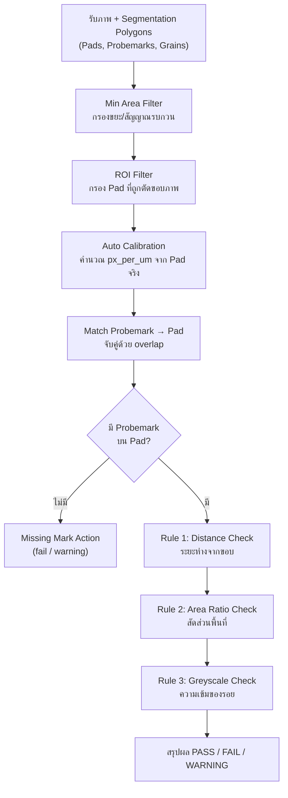

# Inspection Rule Engine — รายละเอียดเงื่อนไขทั้งหมด

> Config file: [`inspection_rules.yaml`](file:///home/nxp1/Desktop/PUNPUNJA/PROJECT/UIIU/backend_imx8/iMX8_AI_Inspection-master/configs/inspection_rules.yaml)
> Rule engine: [`inspection.py`](file:///home/nxp1/Desktop/PUNPUNJA/PROJECT/UIIU/backend_imx8/iMX8_AI_Inspection-master/src/yolo_seg/inspection.py)

---

## Overview — ขั้นตอนการตรวจสอบ

---

## เกณฑ์ทั้งหมด (7 กฎ)

### 1. Distance to Pad Edge — ระยะห่างรอยกดเข็มจากขอบ Pad

| Parameter | ค่าปัจจุบัน | คำอธิบาย |
|---|---|---|
| `fail_distance_um` | **8.0** | ระยะขั้นต่ำ (um) จากจุดที่ใกล้ที่สุดของ probemark ถึงขอบ pad — **น้อยกว่านี้ = FAIL** |
| `warning_distance_um` | **0.0** (ปิด) | ระยะเตือนเพิ่มเติมเหนือ fail threshold — ถ้าตั้ง 3.0 จะเตือนในช่วง 8.0–11.0 um |
| `warning_occurrence_threshold` | **1** | จำนวนครั้งที่ต้องเกิด warning ก่อนจะแสดงผล warning |

**วิธีวัด:** ใช้ `cv2.distanceTransform` บน mask ของ pad — คำนวณระยะจาก**ทุกพิกเซล**ของ probemark ถึงขอบ pad (ไม่ใช่แค่จุดยอด polygon) หาก probemark มีพิกเซลใดอยู่**นอก**ขอบ pad → distance = 0 = **FAIL ทันที**

**ผล:**
- `distance < 8.0 um` → **FAIL** — *"Probemark too close to edge (X.XX um < 8.0 um)"*
- `8.0 ≤ distance < 8.0 + warning_distance` → **WARNING** (ถ้าเปิด)
- `distance ≥ threshold` → **PASS**

---

### 2. Area Ratio — สัดส่วนพื้นที่ Probemark ต่อ Pad

| Parameter | ค่าปัจจุบัน | คำอธิบาย |
|---|---|---|
| `max_area_ratio_pct` | **25.0%** | สัดส่วนพื้นที่สูงสุดของ probemark/pad — **เกินนี้ = FAIL** |
| `min_area_ratio_pct` | **0.0%** (ปิด) | สัดส่วนพื้นที่ต่ำสุดของ probemark/pad — **ต่ำกว่านี้ = FAIL** (ตั้ง 0 = ไม่ใช้) |

**วิธีคำนวณ:** `ratio = (total_pm_area / pad_area) × 100%`
- ใช้ **combined mask** ของทุก probemark ที่จับคู่กับ pad นั้น (ป้องกันการนับซ้ำกรณี YOLO ทำนาย polygon ซ้อนทับ)
- ถ้ามี `target_width/target_height` (160×160) จะย่อสเกลไปคำนวณที่ความละเอียดเป้าหมาย

**ผล:**
- `ratio > 25.0%` → **FAIL** — *"Probemark area too large (X.X% > 25.0%)"*
- `ratio < min_area_ratio_pct` → **FAIL** — *"Probemark area too small (X.X% < Y.Y%)"* (ปิดอยู่)

---

### 3. Missing Probemark — ไม่มีรอยกดเข็มบน Pad

| Parameter | ค่าปัจจุบัน | คำอธิบาย |
|---|---|---|
| `missing_mark_action` | **"fail"** | กรณีตรวจพบ pad แต่ไม่พบ probemark ใดเลย → `"fail"` หรือ `"warning"` |

**ผล:**
- `"fail"` (ปัจจุบัน) → **FAIL** — *"No probemark detected on pad (strict mode)"*
- `"warning"` → **WARNING** — *"[WARNING] No probemark detected — please verify"*

---

### 4. Greyscale Threshold — ความเข้มเฉลี่ยของรอยกดเข็ม

| Parameter | ค่าปัจจุบัน | คำอธิบาย |
|---|---|---|
| `greyscale_threshold` | **0.0** (ปิด) | เกณฑ์ความเข้ม (darkness) ของ probemark — ต่ำกว่านี้ = FAIL |

**วิธีคำนวณ:** `greyscale_val = 255 − avg_intensity(BGR)` ของพิกเซลภายใน probemark mask

**ผล (ถ้าเปิด):**
- `greyscale_val < threshold` → **FAIL** — *"Probemark too light (intensity X.X < threshold)"*
- ปัจจุบัน **ปิดอยู่** (0.0)

---

### 5. No Pad Detected — ไม่พบ Pad เลย

ไม่มี parameter — เป็น logic แบบ hard-coded:

- **ไม่มี pad + มี probemark** → **FAIL** — *"Unknown (Cannot classify pad)"*
- **ไม่มี pad + ไม่มี probemark** → **FAIL** — *"Unknown (Cannot classify pad and probe mark)"*

---

### 6. Minimum Overlap — การจับคู่ Probemark กับ Pad

| Parameter | ค่าปัจจุบัน | คำอธิบาย |
|---|---|---|
| `min_overlap_pct` | **0.0** (ปิดการข้าม) | % overlap ขั้นต่ำของ probemark ที่ต้องทับกับ pad จึงจะจับคู่และตรวจสอบ (ตั้ง 0.0 = ไม่กรองทิ้ง) |

**ผล:** 
- Probemark ที่มี overlap กับ Pad แม้แต่น้อย หรือชิดขอบนอกขอบ จะถูกจับคู่กับ Pad เสมอ และถูกส่งไปตรวจระยะขอบ (Distance Check) ทำให้ได้ผล **FAIL** ทันทีถ้าชิดขอบหรือกินขอบออกนอก Pad
- Probemark ที่อยู่นอก Pad ทั้งหมด (0% overlap) จะถูกจับคู่กับ Pad ที่ใกล้ที่สุด และถูกตัดสินเป็น **FAIL** (`distance = 0.0 um`)

---

### 7. Grain — เม็ดขยะ/สิ่งเจือปน

ไม่มี parameter ที่ทำให้ FAIL — Grain เป็น **visual only** (แสดงเป็นสีม่วงบน visualization)

Grain ถูกนำไปใช้ใน **Pad Shape Correction** เท่านั้น: mask ของ grain ที่ทับ pad จะถูก OR รวมกับ pad mask แล้วทำ Convex Hull เพื่อกู้คืนขอบ pad ที่ถูกบุ๋มจากสิ่งเจือปน

---

## Pre-Processing Filters

### ROI Filter — กรอง Pad ที่อยู่ติดขอบภาพ

| Parameter | ค่าปัจจุบัน | คำอธิบาย |
|---|---|---|
| `v_roi` | **0.7** (70%) | สัดส่วนแนวตั้งของภาพที่จะตรวจ — Pad ที่ bounding box อยู่นอกโซนนี้จะถูกข้าม |
| `h_roi` | **0.7** (70%) | สัดส่วนแนวนอนของภาพที่จะตรวจ — Pad ที่ bounding box อยู่นอกโซนนี้จะถูกข้าม |

ตั้ง `1.0` = ตรวจเต็มภาพ / ค่าปัจจุบัน `0.7` = ตรวจเฉพาะ **70% ตรงกลาง** ของภาพทั้งแนวตั้งและแนวนอน

### Min Area Size Filter — กรองขยะขนาดเล็ก

| Parameter | ค่าปัจจุบัน | คำอธิบาย |
|---|---|---|
| `min_area_sizes[0]` | **300 px** | พื้นที่พิกเซลขั้นต่ำของ **Pad** — เล็กกว่านี้ถือเป็นขยะ |
| `min_area_sizes[1]` | **10 px** | พื้นที่พิกเซลขั้นต่ำของ **Probemark** — เล็กกว่านี้ถือเป็นขยะ |
| `min_area_sizes[2]` | **5 px** | พื้นที่พิกเซลขั้นต่ำของ **Grain** — เล็กกว่านี้ถือเป็นขยะ |

---

## Calibration — การปรับสเกล

| Parameter | ค่าปัจจุบัน | คำอธิบาย |
|---|---|---|
| `pad_width_um` | **null** (ปิด) | ความกว้างจริงของ pad (um) — ถ้าใส่จะคำนวณ `px_per_um` อัตโนมัติต่อภาพ |
| `default_px_per_um` | **1.0** | ค่าเริ่มต้น px ต่อ um — ตั้ง 1.0 = ใช้หน่วยพิกเซลโดยตรง (1 px = 1 um) |
| `target_width` | **160** | ย่อสเกลภาพไปคำนวณเกณฑ์ที่ 160×160 (เลียนแบบ U-Net) |
| `target_height` | **160** | ย่อสเกลภาพไปคำนวณเกณฑ์ที่ 160×160 (เลียนแบบ U-Net) |

> [!IMPORTANT]
> เนื่องจาก `pad_width_um = null` และ `default_px_per_um = 1.0` → ระบบปัจจุบันใช้**หน่วยพิกเซล**โดยตรง (1 px = 1 um)
> ดังนั้น `fail_distance_um: 8.0` จึงหมายถึง **8 พิกเซล** (ที่ความละเอียด 160×160)

---

## สรุปตาราง Decision Matrix

| เงื่อนไข | ผลลัพธ์ | Failure Reason |
|---|---|---|
| PM distance ≤ 8 px (at 160×160) | **FAIL** | Probemark too close to edge |
| PM pixel อยู่นอก pad | **FAIL** | Probemark too close to edge (dist=0) |
| PM area ratio > 25% | **FAIL** | Probemark area too large |
| PM area ratio < 0% (ปิด) | — | (ไม่ใช้งาน) |
| ไม่มี PM บน pad | **FAIL** | No probemark detected on pad (strict mode) |
| ไม่พบ pad เลย | **FAIL** | Unknown (Cannot classify pad) |
| Greyscale < 0 (ปิด) | — | (ไม่ใช้งาน) |
| PM overlap < 50% หรือชิดขอบนอกขอบ | **FAIL** | ตรวจทุก PM เสมอ (`min_overlap_pct=0.0`) ไม่ข้ามรอยชิดขอบ/นอกขอบ |
| Grain | **ไม่กระทบ** | Visual only |
| ผ่านทุกเงื่อนไข | **PASS** | - |

---

## AI Model Format & Quantization (i.MX8 NPU)

- **Target Deployment:** ระบบใช้งานเฉพาะโมเดล **TensorFlow Lite INT8 (`.tflite`)** เพื่อเร่งความเร็วผ่าน NPU Hardware Acceleration บนบอร์ด i.MX8
- **Model Upload Pipeline:**
  - รองรับการอัปโหลดไฟล์โมเดล `.pth` (PyTorch) หรือ `.tflite` (INT8 พร้อมใช้งาน)
  - เมื่ออัปโหลดไฟล์ `.pth` ระบบจะทำ Full INT8 Post-Training Quantization แปลงเป็น `.tflite` อัตโนมัติ โดยใช้ภาพตัวอย่างจริงสำหรับ Calibration
  - **ยกเลิกการแปลงและบันทึกไฟล์ `.onnx`**: ปิดการ Export ไฟล์ ONNX ออกจากระบบแล้ว เนื่องจากฮาร์ดแวร์ NPU บน i.MX8 ใช้งานเฉพาะ TFLite INT8
