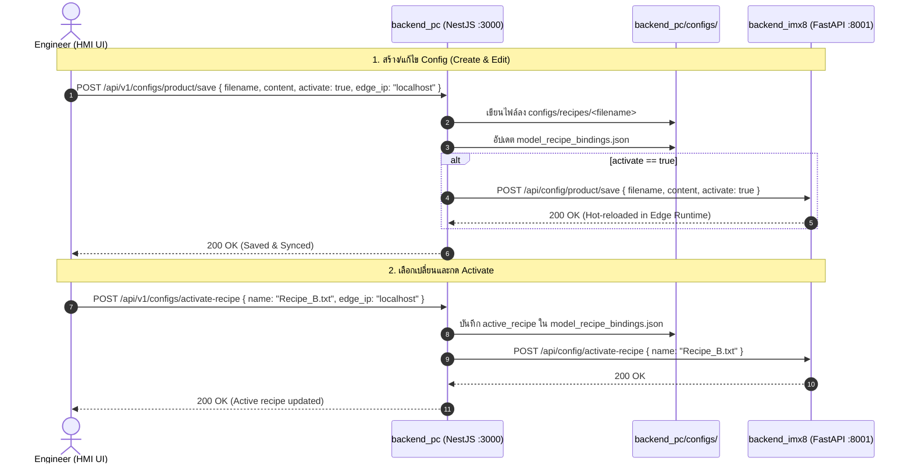

# Central PC Master Config Management Implementation Plan

> **For agentic workers:** REQUIRED SUB-SKILL: Use superpowers:subagent-driven-development (recommended) or superpowers:executing-plans to implement this plan task-by-task. Steps use checkbox (`- [ ]`) syntax for tracking.

**Goal:** ย้ายและตั้งระบบบริหารจัดการไฟล์คอนฟิก (Recipe และ Machine Settings) ทั้งหมด (สร้าง, แก้ไข, อัปโหลด, บันทึก, เลือก Activate) มาไว้ที่ `backend_pc` (NestJS บน Port 3000) ในฐานะ Central Master Store พร้อมระบบ Auto-sync ไปยัง `backend_imx8` (Port 8001) Edge Runtime แบบอัตโนมัติ

**Architecture:** 
- **Central Master (`backend_pc` :3000)**: ทำหน้าที่เป็น Single Source of Truth สำหรับ Recipe & Machine configs ทั้งหมด จัดการไฟล์ใน `backend_pc/configs/`, มี REST API ให้ Frontend เรียกใช้ และเมื่อมีการ Activate หรือ Save & Activate จะ Push ข้อมูลไปยัง `backend_imx8` ทันที
- **Edge Node (`backend_imx8` :8001)**: ทำหน้าที่เป็น Edge AI Inference Pipeline รับคอนฟิกที่ Push มาจาก PC และรันตรวจจับภาพจริงหน้าเครื่อง Prober
- **Frontend HMI (React 19 :5173)**: เรียกจัดการ Master Configs ผ่าน `backend_pc:3000` และเรียก Hardware Telemetry/Ping ผ่าน `backend_imx8:8001`

**Tech Stack:** NestJS (TypeScript), Express, FastAPI (Python), React 19, Vite, Fetch API

---

## Global Constraints

- **Single Source of Truth**: Master Configs ต้องถูกเก็บที่ `backend_pc/configs/recipes/` และ `backend_pc/configs/machines/`
- **Zero Disruptive Changes to Edge**: `backend_imx8` ยังคงมี endpoints เดิมสำหรับรับ config เข้า runtime เพื่อไม่ให้กระทบ Hardware Prober pipeline
- **Auto-Sync / Hot-Reload**: การกด Save & Activate หรือ Activate บน PC ต้องซิงค์เข้า `backend_imx8` ทันที
- **JSON Integrity**: ตรวจสอบความถูกต้องของ JSON เสมอก่อนบันทึกลงดิสก์
- **Safe Path Traversal**: ไม่อนุญาตให้อ่านหรือเขียนไฟล์นอกไดเรกทอรี `configs/`

---

## สถาปัตยกรรมและการไหลของข้อมูล (System Architecture Diagram)

---

## แผนงานราย Task (Bite-Sized Tasks)

### Task 1: แก้ไข Bug `loadBindings` และสร้าง `ConfigsModule` ใน `backend_pc`

**Files:**
- Modify: `backend_pc/src/models/models.service.ts`
- Create: `backend_pc/src/configs/configs.service.ts`
- Create: `backend_pc/src/configs/configs.controller.ts`
- Create: `backend_pc/src/configs/configs.module.ts`
- Modify: `backend_pc/src/app.module.ts`

**Interfaces:**
- `GET /api/v1/configs`: คืนค่า `{ recipes: [], machines: [], active_recipe, active_machine, bindings }`
- `GET /api/v1/configs/:type/:filename`: คืนค่า `{ status, content, parsed }`
- `POST /api/v1/configs/:type/save`: บันทึก/สร้างไฟล์ พร้อม flag `activate` และ auto-sync ไปยัง i.MX8
- `POST /api/v1/configs/upload-product`: รับไฟล์ multipart upload เซฟลง `backend_pc/configs/recipes/`
- `POST /api/v1/configs/upload-machine`: รับไฟล์ multipart upload เซฟลง `backend_pc/configs/machines/`
- `POST /api/v1/configs/activate-recipe`: สั่ง activate และ sync ไปที่ i.MX8
- `POST /api/v1/configs/activate-machine`: สั่ง activate และ sync ไปที่ i.MX8
- `DELETE /api/v1/configs/:type/:filename`: ลบไฟล์คอนฟิก

- [ ] **Step 1.1**: แก้ไข Bug ใน `backend_pc/src/models/models.service.ts` ที่ `bindingsData.bindings` เป็น undefined เมื่ออ่าน `model_recipe_bindings.json`
- [ ] **Step 1.2**: สร้าง `ConfigsService` สำหรับอ่าน/เขียน/ตรวจสอบไฟล์ใน `backend_pc/configs/` พร้อมฟังก์ชันซิงค์ไปยัง `http://${edgeIp}:8001`
- [ ] **Step 1.3**: สร้าง `ConfigsController` รองรับ endpoints ทั้งหมดตาม Interface
- [ ] **Step 1.4**: สร้าง `ConfigsModule` และนำเข้าใน `AppModule`
- [ ] **Step 1.5**: บิลด์และรีสตาร์ท `backend_pc` พร้อมทดสอบเรียก curl ตรวจสอบ 200 OK

---

### Task 2: ปรับ `InspectionContext.jsx` ใน Frontend ให้เรียก Config Management ผ่าน `backend_pc`

**Files:**
- Modify: `frontend/src/context/InspectionContext.jsx`

**Interfaces:**
- ฟังก์ชันคอนฟิกต่อไปนี้จะเปลี่ยนเป้าหมายจาก `apiBase` (8001) เป็น `pcApiBase` (3000):
  - `fetchConfigLibrary()` -> `${pcApiBase}/api/v1/configs`
  - `fetchConfigFile(configType, filename)` -> `${pcApiBase}/api/v1/configs/${configType}/${filename}`
  - `saveConfigFile(configType, filename, content, activate)` -> `${pcApiBase}/api/v1/configs/${configType}/save`
  - `handleActivateRecipe(name)` -> `${pcApiBase}/api/v1/configs/activate-recipe`
  - `handleActivateMachine(name)` -> `${pcApiBase}/api/v1/configs/activate-machine`
  - `handleProductUpload(e)` -> `${pcApiBase}/api/v1/configs/upload-product`
  - `handleMachineUpload(e)` -> `${pcApiBase}/api/v1/configs/upload-machine`
  - `handleDeleteConfigFile(type, filename)` -> `${pcApiBase}/api/v1/configs/${type}/${filename}`
- ส่วนของ Edge Hardware Telemetry / Ping / DB Status / Active Computed Thresholds:
  - ยังคงเรียก `apiBase` (8001) ของ `backend_imx8` เหมือนเดิมอย่างถูกต้อง

- [ ] **Step 2.1**: ปรับ URL ของฟังก์ชัน Config CRUD ใน `InspectionContext.jsx` ไปยัง `pcApiBase`
- [ ] **Step 2.2**: ส่ง `edgeIp` แนบไปด้วยเมื่อมีการ Save & Activate หรือ Activate เพื่อให้ `backend_pc` รู้อยู่เสมอว่าจะต้อง Push คอนฟิกไปที่ Edge IP ใด
- [ ] **Step 2.3**: ตรวจสอบว่า `fetchActiveConfig()` (ที่ดึง telemetry ค่า computed fail distance / max area) ยังทำงานร่วมกับ Edge node ได้อย่างไร้รอยต่อ

---

### Task 3: ทดสอบและตรวจสอบการทำงานแบบครบวงจร (End-to-End Verification)

**Files:**
- Create/Run: `test_pc_config_management.py`
- Verify: `frontend` build (`npm run build`)

- [ ] **Step 3.1**: เขียน automated test script `test_pc_config_management.py` ทดสอบ:
  1. GET `/api/v1/configs` จาก `backend_pc` (port 3000)
  2. GET เนื้อหาไฟล์คอนฟิกจาก `backend_pc`
  3. POST สร้างไฟล์คอนฟิกใหม่บน `backend_pc`
  4. POST เซฟและเปิดใช้งาน (Save & Activate) แล้วตรวจสอบว่าคอนฟิกถูกส่งไปอัปเดตที่ `backend_imx8` (port 8001) จริง
  5. DELETE ลบไฟล์ทดสอบ
- [ ] **Step 3.2**: รัน `npm run build` ใน `frontend` เพื่อยืนยันว่าไม่มีคอมไพล์เออร์เรอร์
- [ ] **Step 3.3**: ตรวจสอบหน้าเว็บ [SettingsPage.jsx](file:///home/nxp1/Desktop/PUNPUNJA/PROJECT/UIIU/frontend/src/pages/SettingsPage.jsx) ยืนยันว่ารายชื่อ Recipe/Machine แสดงผลถูกต้อง และสามารถกด Edit, Create New, Activate จาก `backend_pc` ได้อย่างสมบูรณ์

---

## แผนสำรองและจุดที่ต้องกลับมาดูหากติดขัด (Fallback & Troubleshooting Checklist)

1. **กรณี `backend_pc` (NestJS) คอมไพล์ไม่ผ่าน:**
   - เช็คชนิดตัวแปรและ decorator ใน `configs.controller.ts` และ `configs.service.ts`
   - รัน `npm run build` ในโฟลเดอร์ `backend_pc` เพื่อดู error log ที่ชัดเจน
2. **กรณี `backend_pc` ซิงค์ไปยัง `backend_imx8` ไม่สำเร็จ:**
   - เช็คว่า `backend_imx8` พอร์ต 8001 ยังเปิดอยู่หรือไม่ผ่าน `curl http://localhost:8001/api/models`
   - ใน `ConfigsService` ให้ใส่ try-catch ครอบการ fetch ไปยัง Edge เพื่อให้แม้ว่า Edge node จะ offline อยู่ PC ก็ยังสามารถบันทึก Master Config ลงเครื่อง PC ได้โดยไม่ throw error 500 พังทั้งระบบ
3. **กรณีสิทธิ์การเขียนไฟล์ (File Permissions):**
   - ตรวจสอบว่า process node มีสิทธิ์เขียนลงใน `backend_pc/configs/recipes/` และ `backend_pc/configs/machines/`
